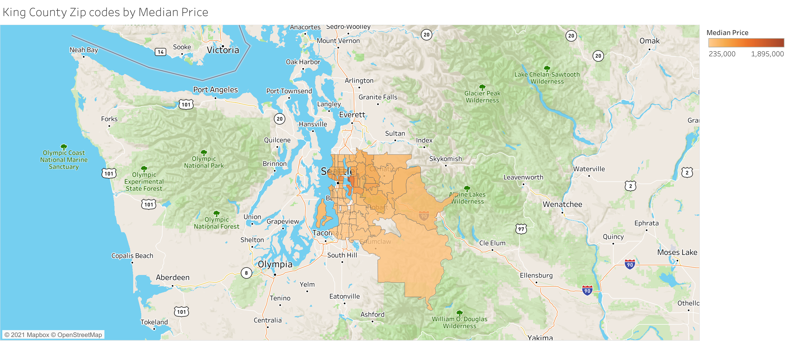
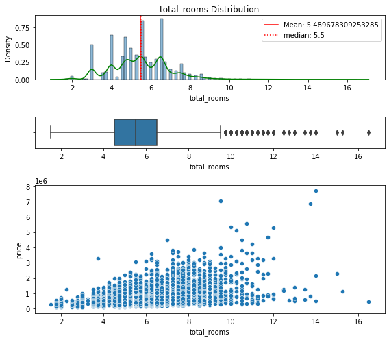
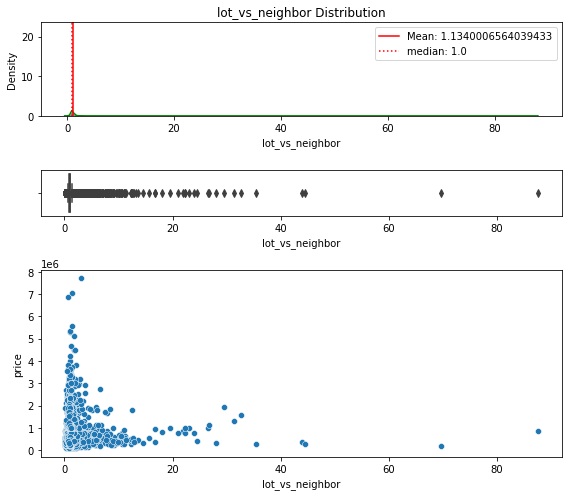

# Kings County Housing Prices
### Using multiple linear regression analysis models to infer the price of homes based on their existing characteristics. 

**Authors**: Ethan Kunin

### Business problem: 

King County home sales have been increasing as Seattle continues to grow. Top notch labor and a favorable climate make King County a desirable place to live and work. Our real estate team has been tasked with advising clients on the fair value of their home. When our team lists our client's homes, we want to ensure the price is accurate compared to the market. 

The model also guides clients on which features to prioritize for increasing home value. This can include renovation, expanding square footage, or other suggestions within the owners control. 

### Data:

-20,000+ rows and 20+ columns

-CSV formatted

## Methods
- Scrub data to handle null values and duplicates
- Add additional features to better infer the price of home based on existing characteristics
- Check for linearity and multicollinearity to make sure that model meets relevant assumptions
- Perform outlier removal methods to better meet the assumptions of the linear regression model
- Use One Hot Encoding to handle categorical variables
- Provide accompanying visualizations to support and interpret the findings of the model
- Circle back to how the multiple linear regression model supports the recommendations for how prices can be predicted based on existing characteristics

## EDA/New Feature Model
-----

Explore adding new features to try and find significant relationships with price. Observe total rooms, living space compared to neighbors, lot space compared to neighbors, and living space compared to lot size. Remake yr_renovated into a binary variable, either home has been renovated or it has not.

-----

EDA Results
- Most of the continuous variables are right skeweed
- Supported by the distribution and mean being greater than the median
- High outlier values on the upper IQR threshold
- Yr_renovated has a lot of 0 values so may be improved by turning into a binary variable
- Bedrooms has a mistaken entry (33 bedrooms)

## Checking Assumptions of Linearity

- There must be a linear relationship between the predictor variable and target variable
    - In our case, the predictor variable refers to the home features and the target refers to price
- By linear relationship, we mean that as the x-value increases, the y-value must change by a constant amount
- If we do not meet assumption of linearity, our model will not accuratly infer home prices
- Must check each predictor that we are we going to include in the model

**Conclusion:**
- Will be dropping: Sqft_lot, Yr_built, sqft_lot15, and live_lot (all continuous)
- Will be One Hot Encoding: Floors, zipcode, and bedrooms
------

## Checking Assumption of No Multicollinearity Between Independent Variables

For a multiple linear regression model to be accurate, it must meet the assumption that the predictor variables do not have multicollinearity. This means that not only should the predictors have a linear relationship with target, but they should not have a linear relationship with each other. In essense, if two variables move very close together, then they are redundant for inferential capabilities and may make it confusing to interpret which variable is contributing to the change in predictor values

--------

# Outlier Removal: IQR + Z-Score
- Due to high outliers shown in the QQ Plot, next step is to remove outliers
- Will try using Z-Score and IQR method
- Will evaluate data loss to determine which methodology I will pursue for modeling purposes

As we can see, each outlier removal type creates varying degrees of data loss. Due to the constraints of linear regression, our model must pass the assumption of homoskedacicity. For that reason, I am going to rule out Z-Score outlier removal methodologies. 

When left with IQR-Price and IQR-All, choosing price makes far more sense because the dat loss is much lower and the R^2 is higher. Max/Min price are very close together

In conclusion, will move forward modeling with **IQR-Price**
## Explore OHE Orindal Variables

------

## Handling Categorical Variables with One Hot Encoding
------
- Dummy variables (one hot encoded variables) must be used to handle categorical variables because otherwise we will run into problems of multicollinearity. In other words, one of the dummy variables will be dropped because it can be explained by all of the others
- Our next step is to One Hot Encode the ordinal variables in our model
- These variables, when evaluated from an ordinal perpsetive, did not have a linear relationship with price
-  However, we will evaluate their P-Values to determine if they have statistical significance as categorical variables
    - Majority of OHE variables must be statistically significant
    - If not, can potentially feature engineer them with nuance

-------

### OHE Ordinal Conclusion
Based on the results we are going to One Hot Encode the following variables:

- Floors: Increases up to 2.5 and then decreases
- Zipcode: Completely random
- Bedrooms: Increases up to 6 and then decreases
- Condition: Increases at 3 and then decreases at 4

This is because they do not appear ordinal. In other words, as the value of the independent variable increases, the price does not change at a constant rate. Check if they are statistically significant

------
## Final Model

- It does not have any statistically insignificant predictor values except for a handful of zipcodes which are OHE variables
- R^2 of 0.83 which means that the predictor variables explain ~83% of the variation in the target variable
- Meets all assumptions:
  - Homoskedacicity
  - Predictor variables have a linear relationship with the target variable
  -  No multicollinearity between predictor variables

-----
## Intepretation

### Evaluating Location

- As we can see, the 15 most impactful predictor variables are all zipcodes. With respect to the intercept, some of the zipcodes can explain ~$600,000 in price.

- 98039, 98004, and 98112 are the top 3 most expensive zip codes. 

- Almost all zip codes are statistically significant as we can see they have a major impact on price

The median home price in King County is \$439,000. The top 10 most expensive zipcodes exceed that value by a minimum of ~\$250,000 up to ~ $450,000. The most expensive zip codes tend to be situated around urban Seattle. 

### Evaluating Non Location Independent Variables

-----

Based on the graph above, waterfront (binary variable) is the most important indicator of price. If a home has a waterfront view, it is estimated to cost ~\$150,000 more. Next comes condition, all condition coefficients have positive values. The greater the condition, the greater the estimated home value will be. Condition represents the overall state of the house. In my estimation, for a home to have a high condition value, it must be constructed with quality materials, have structural integrity, be generally well kept, and look visually appealing from the outside. Next is square foot living, the larger the home, the higher the price. A 1 Standard Deviation increase in sqft_living results in a \$100,000 price increase. This means that that compared to the mean, the home that is 1 standard deviation above the mean sqft_living will cost $100,000 more. 

Bedrooms 9,7, and 10 all have negative impacts on price. As we observed earlier, bedrooms did not have a linear relationship with price which is why we needed to OHE them. 

All floors with respect to 1 floor have a negative relationship with price. This means that if you add a second or third floor your home price will be lower

Grade has a positive impact on price, which is how the King City council determines the quality of the home. Measures if a home needs maintance or is in good condition.

Homes with basements have a lower price on average than those that do not.

View has a positive relationship with price. 

## Conlusions & Recommendations

-----
Zip code, a proxy for location, is the most impactful independent variable. After comes waterfront, sqft_living, condition, and bedrooms

In conclusion, we have deloped a model for the real estate team that can infer home value for houses within a price range of $78,000 - $1,120,000. 

Will recommend to home owners who are trying to improve their home value that they should add a waterfront view if possible. If they are in proximity to water, consider adding windwows to enhance the view. Peform some sort of renovation, and have a high grade, view, and condition. Custom finishes, high quality architecture, and attention to detail will improve the value of the home.

This model is designed to infer a home's price based on existing conditions, not predict the value of the home in the future. 

For further questions email kunin.ethan95@gmail.com
and see accompanying [Juypter Notebook](https://github.com/kuninethan95/dsc-phase-2-project/blob/main/OSEMN%20FinalNB.ipynb)