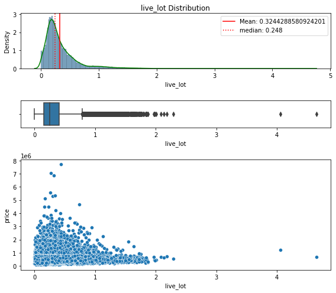
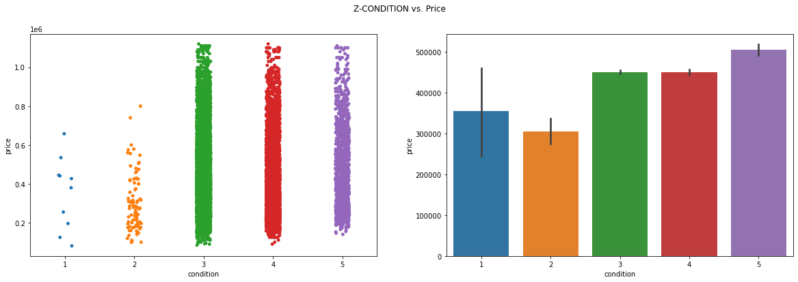
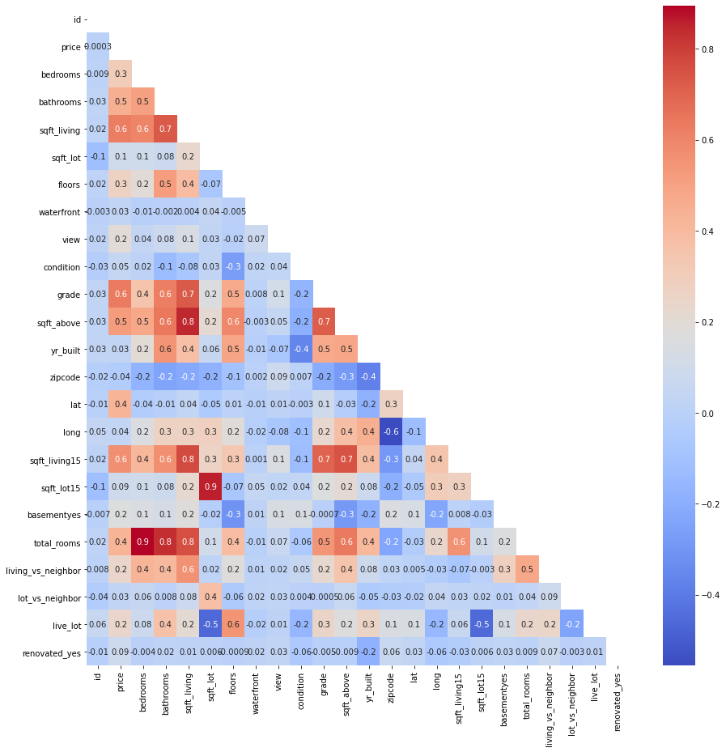
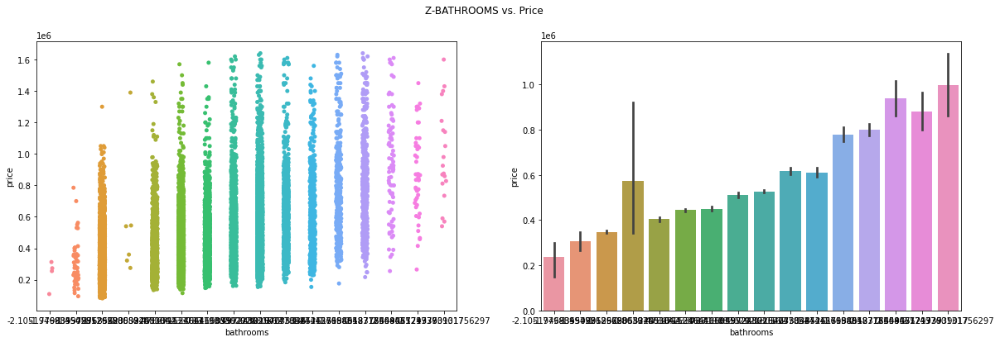
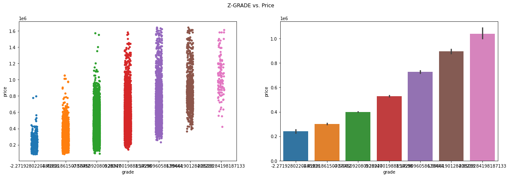
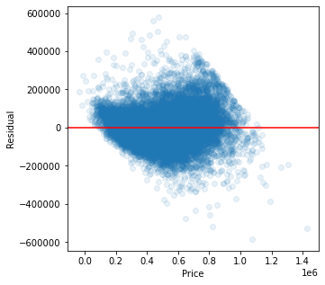
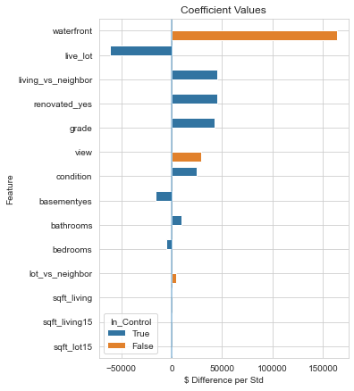
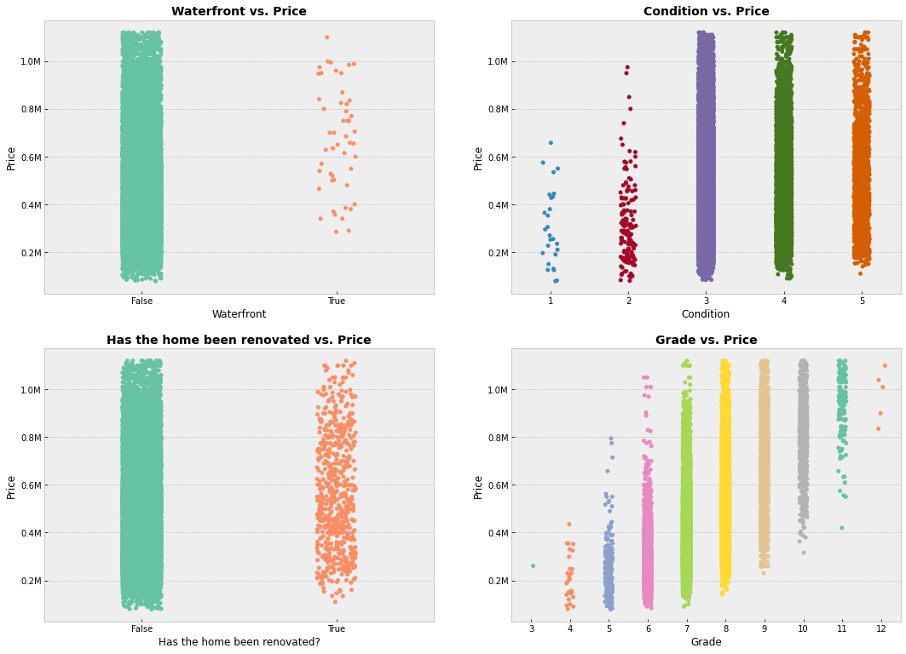
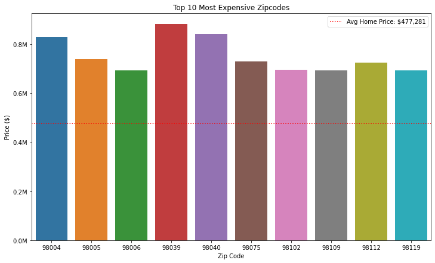

# Kings County Housing Prices
### Using multilinear regression models to infer the price of homes based on their existing characteristics. 

**Authors**: Ethan Kunin


### Business problem: 


King County home sales have been increasing as Seattle continues to grow. Top notch labor and a favorable climate make King County a desirable place to live and work. Our real estate team has been tasked with advising clients on the fair value of their home. When our team lists our client's homes, we want to ensure the price is accurate compared to the market. 

The model also guides clients on which features to prioritize for increasing home value. This can include renovation, expanding square footage, or other suggestions within the owners control. 


### Data:

-20,000+ rows and 20+ columns

-CSV formatted


## Methods
- Scrubbed data to handle duplicates and nulls
- Added additional features to enhance the model
- Eliminated outliers using either IQR method or Z-scores
- Performed multiple multilinear regression analyses to determine the most relevant features for inferring a home's value
- Provided accompanying visualizations


## Baseline Model
- Using all columns as independent variables and targeting price
- Only preprocessing is duplicate and null handling


### Baseline Model Conclusion
- R^2 is 0.70
- QQ Plot deviates significantly around the 3rd quantile
- Floors and basement are not statistically significant
- Residuals trail off around $1.25 million, begins to become cone shaped and skew upwards
- Model does not meet assumption of homoscedasticity


## EDA/New Feature Model
-----

Explore adding new features to try and find significant relationships with price. Observe total rooms, living space compared to neighbors, lot space compared to neighbors, and living space compared to lot size. Remake yr_renovated into a binary variable, either home has been renovated or it has not.

-----





EDA Results
- Most of the data is right skewed
- Supported by the mean being greater than the median
- Significant number of outliers on the right tail for each new feature
- Homes which have been renovated have a greater mean price than those that have not


### New Feature Model Conclusion
- R^2 imporved to 0.71
- Basementyes and lot_vs_neighbor are statistically insignificant
- QQ plot deviates significantly around the second quantile
- Does not meet assumption of homoscedasticity
- Next step should be to remove outliers and rerun tests

------

## Z-Score Outlier Removal
- Removing outliers based on Z-Scores may address issue of heteroskedacicity
- It will reduce right skew because values on the tails will be removed
- Begin by testing Z-Score removal for all features, including price
- Conclusions will not be adjusted simply because data is scaled, removing outliers will alter results


--------


    Num observations before dropping with Z-score: 21,387
    ----Dropping all rows where an outlier occurrs in at least one column----
    Num observations after dropping with Z-score: 18,739
    Num observations removed: 2,648 
    Num observations removed as percent of original DF: 12.38%
    
    Max price observation: $1,640,000.0
    Min price observation: $82,500.0

---------

### Z-Score Outlier Removal Conclusion
- R^2 dropped to 0.691
- QQ plot is more normal, deviates at second quantile but to a lesser degree
- Negative quantiles are more normal
- Sqft_lot, floors, sqft_lot15 are statistically insignificant
- Does not pass assumption of homoscedasticity
-----

## IQR Outlier Removal
- Checking if IQR outlier removal does a better job at normalizing QQ plot and passing assumption of homoscedasticity
- Begin by classifying observation as an outlier if at least one column is considered an outlier
- IQR method will eliminate more values because it is more strict at classifying outliers than Z-Score


---

```
    Num observations before dropping with IQR: 21,387
    Num observations after dropping with IQR: 13,389
    Num observations removed: 7,998
    Num observations removed as percent of original DF: 0.37%

    Max price outliers removed: $1,120,000.0
    Min price outliers removed: $81,000.0
```


-------


### IQR Outlier Removal Conclusion
- R^2 has increased to 0.71
- Living_vs_neighbor is statistically insignificant
- QQ plot better meets assumptions. Small deviation around the 2nd quantile
- Homoscedasticity has improved because more outlier variables have been removed
- This model meets more assumptions but a significant number of values have been dropped (37%). This narrows the scope of the models inferential capabilities as shown by min/max prices
- It also narrows the scope of inference accross all features ie bedrooms, sqft_lot, bathrooms, etc... 

## Explore OHE Orindal Variables
- Identifying ordinal variables that may not have a linear relationship with price
- Use One Hot Encodoing to treat these variables as categorical variables




```
Floor and condition do not have strong linear relationships with price
```
-------

### OHE Ordinal Conclusion
- R^2 of 0.71
- Majority of the OHE variables are not statistically significant so should be dropped
- Floor and condition had more statistical significance as oridnal variables
- QQ plot looks normal
- Assumption homoscedasticity appears to have been met

------

## Check assumptions of multicollinearity and correlation
- Independent variables must have a linear relationship with price
- Independent variables cannot be collinear


```
- DROP - sqft_lot15
- DROP - total rooms because it takes away from nuance of bath/bed
- DROP - sqft_above
- DROP - sqft_living_15
```


### Multicollinearity Conclusions
- R^2 of 0.708
- QQ plot meets assumptions
- No features with insignificant p-values
- Homoscedasticity passes assumptions
----
## Check Assumption of Linearity
- Independent variables must have a lineaer relationship with price
- Sqft_lot and lot_vs_neighbor do not have a linear relationship with price

-----


-----

### Linearity Conclusion
- R^2 has dropped to 0.67
- No insignificant p-values
- QQ plot looks normal
- Skedacicity looks normal
- One of the features dropped may have had a significant impact on our target variable because the R^2 has been reduced

## Pivoting Back to Z-Score

-----
- Testing if similar results can be achieved while dropping less data
- Overall, unsasatisfied with model because of its limited scope. This was was due to 37% of the data observations being considered outliers data and dropped
- Too much data loss to be able to provide accurate inferences for a wide range of clientele 
- Z-score is less strict on classifying outliers so the model can provide a wider range of inferences
-----

## Check for multicollinearity


```
Not going to OHE the variables that were unsuccesful in IQR method
```

----

  


## Check for Linear Relationships
- Total rooms does not have a linear relationship with price


### Multicolinearity and Linearity Assumptions Conclusion
- R^2 of 0.69
- No statistically insignificant features but floors, basement, and sqft lot are close to threshold
- QQ possibly meets assumptions but veers up at the 2nd quantile
- Skedacity vears upward as home prices surpass $1,2050,000

## Check for possible One Hot Encoded Variables


  
     
 
 
 
 
  

------


All ordinal variables except for floor have a linear relationship with price. Testing zip code as a categorical variable


----------


### Checking for Linearity  and adding Zip Code Conclusion
- When adding zipcode as a categorical variable, R^2 increases up to 0.834
- Floors are statistically insignificant
- Some zip codes were statistically insignificant but not enough to drop the variables
- QQ plot trails off 2 quantile
- Homoscedasticity breaks down around $1,250,000


## Going back to IQR because of heteroscedasticity
- IQR method is more strict towards removing outliers
- Using IQR method but only eliminiting observations based on price outliers 
- Able to provide inferences for more types of homes and wider range of home prices

```

    Num observations before removal: 21,387
    Num observations after removal:  20,235
    Num observations removed:  1,152
    Percent observations removed:  5.39%
    --------------------------------------------
    --------------------------------------------
    Max Home Price: $1,120,000.0
    Min Home Price: $78,000.0

```
  


## Check for Multicollinearity


 


```
Remove total_rooms and sqft_above
```


## Check for assumptions of Linearity
- Year built and sqft_lot do not have linear relationships with price


 


## Final Model


<table class="simpletable">
<caption>OLS Regression Results</caption>
<tr>
  <th>Dep. Variable:</th>          <td>price</td>      <th>  R-squared:         </th>  <td>   0.832</td>  
</tr>
<tr>
  <th>Model:</th>                   <td>OLS</td>       <th>  Adj. R-squared:    </th>  <td>   0.831</td>  
</tr>
<tr>
  <th>Method:</th>             <td>Least Squares</td>  <th>  F-statistic:       </th>  <td>   1174.</td>  
</tr>
<tr>
  <th>Date:</th>             <td>Fri, 16 Apr 2021</td> <th>  Prob (F-statistic):</th>   <td>  0.00</td>   
</tr>
<tr>
  <th>Time:</th>                 <td>15:27:30</td>     <th>  Log-Likelihood:    </th> <td>-2.5831e+05</td>
</tr>
<tr>
  <th>No. Observations:</th>      <td> 20235</td>      <th>  AIC:               </th>  <td>5.168e+05</td> 
</tr>
<tr>
  <th>Df Residuals:</th>          <td> 20149</td>      <th>  BIC:               </th>  <td>5.175e+05</td> 
</tr>
<tr>
  <th>Df Model:</th>              <td>    85</td>      <th>                     </th>      <td> </td>     
</tr>
<tr>
  <th>Covariance Type:</th>      <td>nonrobust</td>    <th>                     </th>      <td> </td>     
</tr>
</table>
<table class="simpletable">
<tr>
           <td></td>             <th>coef</th>     <th>std err</th>      <th>t</th>      <th>P>|t|</th>  <th>[0.025</th>    <th>0.975]</th>  
</tr>
<tr>
  <th>Intercept</th>          <td>-1.847e+07</td> <td> 3.33e+06</td> <td>   -5.548</td> <td> 0.000</td> <td> -2.5e+07</td> <td>-1.19e+07</td>
</tr>
<tr>
  <th>bedrooms</th>           <td>-5169.3252</td> <td>  905.283</td> <td>   -5.710</td> <td> 0.000</td> <td>-6943.754</td> <td>-3394.897</td>
</tr>
<tr>
  <th>bathrooms</th>          <td> 9690.2367</td> <td> 1381.972</td> <td>    7.012</td> <td> 0.000</td> <td> 6981.459</td> <td> 1.24e+04</td>
</tr>
<tr>
  <th>sqft_living</th>        <td>   77.5541</td> <td>    3.642</td> <td>   21.296</td> <td> 0.000</td> <td>   70.416</td> <td>   84.692</td>
</tr>
<tr>
  <th>waterfront</th>         <td> 1.642e+05</td> <td> 1.29e+04</td> <td>   12.725</td> <td> 0.000</td> <td> 1.39e+05</td> <td> 1.89e+05</td>
</tr>
<tr>
  <th>view</th>               <td> 2.968e+04</td> <td> 1047.450</td> <td>   28.339</td> <td> 0.000</td> <td> 2.76e+04</td> <td> 3.17e+04</td>
</tr>
<tr>
  <th>condition</th>          <td> 2.524e+04</td> <td> 1003.160</td> <td>   25.158</td> <td> 0.000</td> <td> 2.33e+04</td> <td> 2.72e+04</td>
</tr>
<tr>
  <th>grade</th>              <td>  4.25e+04</td> <td>  967.328</td> <td>   43.938</td> <td> 0.000</td> <td> 4.06e+04</td> <td> 4.44e+04</td>
</tr>
<tr>
  <th>lat</th>                <td> 1.655e+05</td> <td> 3.45e+04</td> <td>    4.800</td> <td> 0.000</td> <td> 9.79e+04</td> <td> 2.33e+05</td>
</tr>
<tr>
  <th>long</th>               <td>-8.362e+04</td> <td> 2.46e+04</td> <td>   -3.396</td> <td> 0.001</td> <td>-1.32e+05</td> <td>-3.54e+04</td>
</tr>
<tr>
  <th>sqft_living15</th>      <td>   62.1707</td> <td>    3.865</td> <td>   16.087</td> <td> 0.000</td> <td>   54.596</td> <td>   69.746</td>
</tr>
<tr>
  <th>sqft_lot15</th>         <td>    0.2088</td> <td>    0.026</td> <td>    7.928</td> <td> 0.000</td> <td>    0.157</td> <td>    0.260</td>
</tr>
<tr>
  <th>basementyes</th>        <td>-1.632e+04</td> <td> 1406.011</td> <td>  -11.607</td> <td> 0.000</td> <td>-1.91e+04</td> <td>-1.36e+04</td>
</tr>
<tr>
  <th>living_vs_neighbor</th> <td> 4.545e+04</td> <td> 6227.497</td> <td>    7.299</td> <td> 0.000</td> <td> 3.32e+04</td> <td> 5.77e+04</td>
</tr>
<tr>
  <th>lot_vs_neighbor</th>    <td> 4741.1058</td> <td>  489.795</td> <td>    9.680</td> <td> 0.000</td> <td> 3781.068</td> <td> 5701.143</td>
</tr>
<tr>
  <th>live_lot</th>           <td>-6.139e+04</td> <td> 3080.434</td> <td>  -19.928</td> <td> 0.000</td> <td>-6.74e+04</td> <td>-5.53e+04</td>
</tr>
<tr>
  <th>renovated_yes</th>      <td> 4.491e+04</td> <td> 3534.157</td> <td>   12.707</td> <td> 0.000</td> <td>  3.8e+04</td> <td> 5.18e+04</td>
</tr>
<tr>
  <th>zipcode_98002</th>      <td> 1.816e+04</td> <td> 7690.853</td> <td>    2.361</td> <td> 0.018</td> <td> 3082.507</td> <td> 3.32e+04</td>
</tr>
<tr>
  <th>zipcode_98003</th>      <td>-7583.6840</td> <td> 6874.156</td> <td>   -1.103</td> <td> 0.270</td> <td>-2.11e+04</td> <td> 5890.223</td>
</tr>
<tr>
  <th>zipcode_98004</th>      <td> 4.657e+05</td> <td> 1.35e+04</td> <td>   34.401</td> <td> 0.000</td> <td> 4.39e+05</td> <td> 4.92e+05</td>
</tr>
<tr>
  <th>zipcode_98005</th>      <td> 2.846e+05</td> <td> 1.36e+04</td> <td>   20.880</td> <td> 0.000</td> <td> 2.58e+05</td> <td> 3.11e+05</td>
</tr>
<tr>
  <th>zipcode_98006</th>      <td> 2.374e+05</td> <td> 1.12e+04</td> <td>   21.168</td> <td> 0.000</td> <td> 2.15e+05</td> <td> 2.59e+05</td>
</tr>
<tr>
  <th>zipcode_98007</th>      <td> 2.218e+05</td> <td>  1.4e+04</td> <td>   15.836</td> <td> 0.000</td> <td> 1.94e+05</td> <td> 2.49e+05</td>
</tr>
<tr>
  <th>zipcode_98008</th>      <td> 2.086e+05</td> <td> 1.33e+04</td> <td>   15.635</td> <td> 0.000</td> <td> 1.82e+05</td> <td> 2.35e+05</td>
</tr>
<tr>
  <th>zipcode_98010</th>      <td> 1.008e+05</td> <td> 1.18e+04</td> <td>    8.560</td> <td> 0.000</td> <td> 7.77e+04</td> <td> 1.24e+05</td>
</tr>
<tr>
  <th>zipcode_98011</th>      <td> 7.764e+04</td> <td> 1.73e+04</td> <td>    4.483</td> <td> 0.000</td> <td> 4.37e+04</td> <td> 1.12e+05</td>
</tr>
<tr>
  <th>zipcode_98014</th>      <td> 8.121e+04</td> <td> 1.91e+04</td> <td>    4.261</td> <td> 0.000</td> <td> 4.39e+04</td> <td> 1.19e+05</td>
</tr>
<tr>
  <th>zipcode_98019</th>      <td> 5.264e+04</td> <td> 1.87e+04</td> <td>    2.811</td> <td> 0.005</td> <td> 1.59e+04</td> <td> 8.93e+04</td>
</tr>
<tr>
  <th>zipcode_98022</th>      <td> 4.322e+04</td> <td> 1.03e+04</td> <td>    4.206</td> <td> 0.000</td> <td> 2.31e+04</td> <td> 6.34e+04</td>
</tr>
<tr>
  <th>zipcode_98023</th>      <td>-2.904e+04</td> <td> 6341.463</td> <td>   -4.579</td> <td> 0.000</td> <td>-4.15e+04</td> <td>-1.66e+04</td>
</tr>
<tr>
  <th>zipcode_98024</th>      <td> 1.434e+05</td> <td> 1.69e+04</td> <td>    8.489</td> <td> 0.000</td> <td>  1.1e+05</td> <td> 1.76e+05</td>
</tr>
<tr>
  <th>zipcode_98027</th>      <td>   1.8e+05</td> <td> 1.14e+04</td> <td>   15.844</td> <td> 0.000</td> <td> 1.58e+05</td> <td> 2.02e+05</td>
</tr>
<tr>
  <th>zipcode_98028</th>      <td> 6.285e+04</td> <td> 1.68e+04</td> <td>    3.731</td> <td> 0.000</td> <td> 2.98e+04</td> <td> 9.59e+04</td>
</tr>
<tr>
  <th>zipcode_98029</th>      <td> 2.171e+05</td> <td>  1.3e+04</td> <td>   16.703</td> <td> 0.000</td> <td> 1.92e+05</td> <td> 2.43e+05</td>
</tr>
<tr>
  <th>zipcode_98030</th>      <td> 2044.3475</td> <td> 7574.059</td> <td>    0.270</td> <td> 0.787</td> <td>-1.28e+04</td> <td> 1.69e+04</td>
</tr>
<tr>
  <th>zipcode_98031</th>      <td> 1246.2076</td> <td> 7897.203</td> <td>    0.158</td> <td> 0.875</td> <td>-1.42e+04</td> <td> 1.67e+04</td>
</tr>
<tr>
  <th>zipcode_98032</th>      <td>-1.343e+04</td> <td> 9156.535</td> <td>   -1.467</td> <td> 0.142</td> <td>-3.14e+04</td> <td> 4512.678</td>
</tr>
<tr>
  <th>zipcode_98033</th>      <td> 2.687e+05</td> <td> 1.46e+04</td> <td>   18.443</td> <td> 0.000</td> <td>  2.4e+05</td> <td> 2.97e+05</td>
</tr>
<tr>
  <th>zipcode_98034</th>      <td> 1.271e+05</td> <td> 1.55e+04</td> <td>    8.186</td> <td> 0.000</td> <td> 9.67e+04</td> <td> 1.58e+05</td>
</tr>
<tr>
  <th>zipcode_98038</th>      <td> 4.819e+04</td> <td> 8559.523</td> <td>    5.630</td> <td> 0.000</td> <td> 3.14e+04</td> <td>  6.5e+04</td>
</tr>
<tr>
  <th>zipcode_98039</th>      <td> 5.827e+05</td> <td> 4.41e+04</td> <td>   13.205</td> <td> 0.000</td> <td> 4.96e+05</td> <td> 6.69e+05</td>
</tr>
<tr>
  <th>zipcode_98040</th>      <td> 3.749e+05</td> <td>  1.2e+04</td> <td>   31.292</td> <td> 0.000</td> <td> 3.51e+05</td> <td> 3.98e+05</td>
</tr>
<tr>
  <th>zipcode_98042</th>      <td> 1.081e+04</td> <td> 7265.296</td> <td>    1.487</td> <td> 0.137</td> <td>-3434.619</td> <td>  2.5e+04</td>
</tr>
<tr>
  <th>zipcode_98045</th>      <td> 1.213e+05</td> <td> 1.59e+04</td> <td>    7.633</td> <td> 0.000</td> <td> 9.01e+04</td> <td> 1.52e+05</td>
</tr>
<tr>
  <th>zipcode_98052</th>      <td> 2.081e+05</td> <td> 1.48e+04</td> <td>   14.106</td> <td> 0.000</td> <td> 1.79e+05</td> <td> 2.37e+05</td>
</tr>
<tr>
  <th>zipcode_98053</th>      <td> 1.982e+05</td> <td> 1.58e+04</td> <td>   12.508</td> <td> 0.000</td> <td> 1.67e+05</td> <td> 2.29e+05</td>
</tr>
<tr>
  <th>zipcode_98055</th>      <td> 3.041e+04</td> <td> 8852.569</td> <td>    3.435</td> <td> 0.001</td> <td> 1.31e+04</td> <td> 4.78e+04</td>
</tr>
<tr>
  <th>zipcode_98056</th>      <td> 7.976e+04</td> <td> 9638.778</td> <td>    8.275</td> <td> 0.000</td> <td> 6.09e+04</td> <td> 9.87e+04</td>
</tr>
<tr>
  <th>zipcode_98058</th>      <td> 2.675e+04</td> <td> 8354.950</td> <td>    3.202</td> <td> 0.001</td> <td> 1.04e+04</td> <td> 4.31e+04</td>
</tr>
<tr>
  <th>zipcode_98059</th>      <td> 8.592e+04</td> <td> 9449.193</td> <td>    9.093</td> <td> 0.000</td> <td> 6.74e+04</td> <td> 1.04e+05</td>
</tr>
<tr>
  <th>zipcode_98065</th>      <td> 1.276e+05</td> <td> 1.47e+04</td> <td>    8.693</td> <td> 0.000</td> <td> 9.88e+04</td> <td> 1.56e+05</td>
</tr>
<tr>
  <th>zipcode_98070</th>      <td> 7.276e+04</td> <td> 1.13e+04</td> <td>    6.458</td> <td> 0.000</td> <td> 5.07e+04</td> <td> 9.48e+04</td>
</tr>
<tr>
  <th>zipcode_98072</th>      <td> 1.125e+05</td> <td> 1.73e+04</td> <td>    6.517</td> <td> 0.000</td> <td> 7.87e+04</td> <td> 1.46e+05</td>
</tr>
<tr>
  <th>zipcode_98074</th>      <td> 1.883e+05</td> <td>  1.4e+04</td> <td>   13.492</td> <td> 0.000</td> <td> 1.61e+05</td> <td> 2.16e+05</td>
</tr>
<tr>
  <th>zipcode_98075</th>      <td> 2.076e+05</td> <td> 1.35e+04</td> <td>   15.427</td> <td> 0.000</td> <td> 1.81e+05</td> <td> 2.34e+05</td>
</tr>
<tr>
  <th>zipcode_98077</th>      <td> 1.163e+05</td> <td>  1.8e+04</td> <td>    6.461</td> <td> 0.000</td> <td>  8.1e+04</td> <td> 1.52e+05</td>
</tr>
<tr>
  <th>zipcode_98092</th>      <td>-7103.7523</td> <td> 6871.133</td> <td>   -1.034</td> <td> 0.301</td> <td>-2.06e+04</td> <td> 6364.231</td>
</tr>
<tr>
  <th>zipcode_98102</th>      <td> 3.838e+05</td> <td> 1.52e+04</td> <td>   25.301</td> <td> 0.000</td> <td> 3.54e+05</td> <td> 4.14e+05</td>
</tr>
<tr>
  <th>zipcode_98103</th>      <td> 2.767e+05</td> <td> 1.39e+04</td> <td>   19.850</td> <td> 0.000</td> <td> 2.49e+05</td> <td> 3.04e+05</td>
</tr>
<tr>
  <th>zipcode_98105</th>      <td> 3.403e+05</td> <td> 1.46e+04</td> <td>   23.352</td> <td> 0.000</td> <td> 3.12e+05</td> <td> 3.69e+05</td>
</tr>
<tr>
  <th>zipcode_98106</th>      <td> 9.215e+04</td> <td> 1.03e+04</td> <td>    8.937</td> <td> 0.000</td> <td> 7.19e+04</td> <td> 1.12e+05</td>
</tr>
<tr>
  <th>zipcode_98107</th>      <td> 2.771e+05</td> <td> 1.44e+04</td> <td>   19.288</td> <td> 0.000</td> <td> 2.49e+05</td> <td> 3.05e+05</td>
</tr>
<tr>
  <th>zipcode_98108</th>      <td> 8.917e+04</td> <td> 1.13e+04</td> <td>    7.875</td> <td> 0.000</td> <td>  6.7e+04</td> <td> 1.11e+05</td>
</tr>
<tr>
  <th>zipcode_98109</th>      <td> 3.806e+05</td> <td> 1.53e+04</td> <td>   24.895</td> <td> 0.000</td> <td> 3.51e+05</td> <td> 4.11e+05</td>
</tr>
<tr>
  <th>zipcode_98112</th>      <td> 3.964e+05</td> <td> 1.37e+04</td> <td>   29.032</td> <td> 0.000</td> <td>  3.7e+05</td> <td> 4.23e+05</td>
</tr>
<tr>
  <th>zipcode_98115</th>      <td> 2.738e+05</td> <td> 1.42e+04</td> <td>   19.284</td> <td> 0.000</td> <td> 2.46e+05</td> <td> 3.02e+05</td>
</tr>
<tr>
  <th>zipcode_98116</th>      <td> 2.615e+05</td> <td> 1.15e+04</td> <td>   22.694</td> <td> 0.000</td> <td> 2.39e+05</td> <td> 2.84e+05</td>
</tr>
<tr>
  <th>zipcode_98117</th>      <td> 2.635e+05</td> <td> 1.44e+04</td> <td>   18.350</td> <td> 0.000</td> <td> 2.35e+05</td> <td> 2.92e+05</td>
</tr>
<tr>
  <th>zipcode_98118</th>      <td>  1.43e+05</td> <td>    1e+04</td> <td>   14.259</td> <td> 0.000</td> <td> 1.23e+05</td> <td> 1.63e+05</td>
</tr>
<tr>
  <th>zipcode_98119</th>      <td> 3.693e+05</td> <td> 1.42e+04</td> <td>   25.984</td> <td> 0.000</td> <td> 3.41e+05</td> <td> 3.97e+05</td>
</tr>
<tr>
  <th>zipcode_98122</th>      <td> 2.848e+05</td> <td> 1.25e+04</td> <td>   22.844</td> <td> 0.000</td> <td>  2.6e+05</td> <td> 3.09e+05</td>
</tr>
<tr>
  <th>zipcode_98125</th>      <td> 1.338e+05</td> <td> 1.53e+04</td> <td>    8.720</td> <td> 0.000</td> <td> 1.04e+05</td> <td> 1.64e+05</td>
</tr>
<tr>
  <th>zipcode_98126</th>      <td> 1.624e+05</td> <td> 1.05e+04</td> <td>   15.404</td> <td> 0.000</td> <td> 1.42e+05</td> <td> 1.83e+05</td>
</tr>
<tr>
  <th>zipcode_98133</th>      <td> 8.623e+04</td> <td> 1.58e+04</td> <td>    5.441</td> <td> 0.000</td> <td> 5.52e+04</td> <td> 1.17e+05</td>
</tr>
<tr>
  <th>zipcode_98136</th>      <td> 2.265e+05</td> <td> 1.08e+04</td> <td>   20.944</td> <td> 0.000</td> <td> 2.05e+05</td> <td> 2.48e+05</td>
</tr>
<tr>
  <th>zipcode_98144</th>      <td> 2.197e+05</td> <td> 1.16e+04</td> <td>   18.876</td> <td> 0.000</td> <td> 1.97e+05</td> <td> 2.43e+05</td>
</tr>
<tr>
  <th>zipcode_98146</th>      <td> 8.412e+04</td> <td> 9681.738</td> <td>    8.688</td> <td> 0.000</td> <td> 6.51e+04</td> <td> 1.03e+05</td>
</tr>
<tr>
  <th>zipcode_98148</th>      <td>  3.94e+04</td> <td>  1.3e+04</td> <td>    3.026</td> <td> 0.002</td> <td> 1.39e+04</td> <td> 6.49e+04</td>
</tr>
<tr>
  <th>zipcode_98155</th>      <td> 6.831e+04</td> <td> 1.65e+04</td> <td>    4.140</td> <td> 0.000</td> <td>  3.6e+04</td> <td> 1.01e+05</td>
</tr>
<tr>
  <th>zipcode_98166</th>      <td> 7.861e+04</td> <td> 8854.123</td> <td>    8.878</td> <td> 0.000</td> <td> 6.13e+04</td> <td>  9.6e+04</td>
</tr>
<tr>
  <th>zipcode_98168</th>      <td> 2.352e+04</td> <td> 9310.281</td> <td>    2.526</td> <td> 0.012</td> <td> 5272.091</td> <td> 4.18e+04</td>
</tr>
<tr>
  <th>zipcode_98177</th>      <td> 1.422e+05</td> <td> 1.66e+04</td> <td>    8.546</td> <td> 0.000</td> <td>  1.1e+05</td> <td> 1.75e+05</td>
</tr>
<tr>
  <th>zipcode_98178</th>      <td> 3.116e+04</td> <td> 9626.514</td> <td>    3.237</td> <td> 0.001</td> <td> 1.23e+04</td> <td>    5e+04</td>
</tr>
<tr>
  <th>zipcode_98188</th>      <td> 1.347e+04</td> <td> 9808.419</td> <td>    1.373</td> <td> 0.170</td> <td>-5756.737</td> <td> 3.27e+04</td>
</tr>
<tr>
  <th>zipcode_98198</th>      <td> 9933.1791</td> <td> 7460.514</td> <td>    1.331</td> <td> 0.183</td> <td>-4690.038</td> <td> 2.46e+04</td>
</tr>
<tr>
  <th>zipcode_98199</th>      <td> 3.118e+05</td> <td> 1.38e+04</td> <td>   22.669</td> <td> 0.000</td> <td> 2.85e+05</td> <td> 3.39e+05</td>
</tr>
</table>
<table class="simpletable">
<tr>
  <th>Omnibus:</th>       <td>1930.868</td> <th>  Durbin-Watson:     </th> <td>   1.806</td>
</tr>
<tr>
  <th>Prob(Omnibus):</th>  <td> 0.000</td>  <th>  Jarque-Bera (JB):  </th> <td>6899.678</td>
</tr>
<tr>
  <th>Skew:</th>           <td> 0.455</td>  <th>  Prob(JB):          </th> <td>    0.00</td>
</tr>
<tr>
  <th>Kurtosis:</th>       <td> 5.712</td>  <th>  Cond. No.          </th> <td>1.64e+08</td>
</tr>
</table><br/><br/>Notes:<br/>[1] Standard Errors assume that the covariance matrix of the errors is correctly specified.<br/>[2] The condition number is large, 1.64e+08. This might indicate that there are<br/>strong multicollinearity or other numerical problems.


----
QQ Plot and Homoscedasticity

-----

 

 


### Final Model Conclusion
- R^2 0.832
- All assumptions have been met
- Using 20,235 observations

## Final Thoughts

     

```
Variables in the owners control
```

   

-------

For a 1 Standard Deviation increase per each feature. The impact on price is as follows (for binary consider T/F):

- Waterfront: +$163,793
- Sqft living space versus your neighbor: +$45,297
- If your home has been renovated: +$45,056
- Grade (as deemed by city council): +$42,612
- View (quality of scenery): +$29,687
- Condition: +$25,147
- Bathrooms: +$9,536
- Lot Size vs. Neighbor: +$4,740

For a 1 Standard Deviation increase per each feature. The impace is as follows:
- Sqft Living vs Lot size: -$60,847
- Basement: -$16,074
- Bedrooms: -$5,161



------

## Conlusions & Recommendations

-----
Zip code, a proxy for location, is the most impactful independent variable. After comes waterfront, sqft_living vs neighborhood average, if the home has been renovated, and grade given by city coucil. Live vs. lot, basement, and bedrooms have a negative relationship with price. Home prices tend to be erratic in terms of month of sale, at least for 2014-2015

In conclusion, we have deloped a model for the real estate team that can infer home value for houses within a price range of $78,000 - $1,120,000. 

Will recommend to home owners who are trying to improve their home value that they should add a waterfront view if possible. If they are in proximity to water, consider adding windwows to enhance the view. Peform some sort of renovation, and have a high grade, view, and condition. A basement will reduce home value and the larger the proportion of the home to the total lot, the lower the price of the home. 

This model is designed to infer a home's price based on existing conditions, not predict the value of the home in the future. 