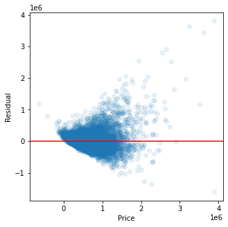
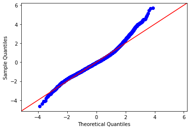

# Kings County Housing Prices
### Using multilinear regression to predict the price of homes and recommend to homeowners the best ways to increase their home value. 

**Authors**: Ethan Kunin

The contents of this repository detail an analysis of the module one project. This analysis is detailed in hopes of making the work accessible and replicable.


### Business problem: 


King County home sales have been increasing as Seattle continues to grow. Top notch labor and a favorable climate make King County a desirable place to live and work. Our real estate team has been tasked with advising clients on the best ways to increase their home value. This could mean renovation, expanding square footage, or other unique recommendations. We are also assisting them in determing a fair price for their home when they decide to put in on the market. 


### Data:
Data originates from Kaggle. 20,000+ rows and 20+ columns. CSV formatted. 


## Methods
- Scrubbed data to deal with duplicates and nulls
- Eliminated outliers using either IQR method or Z-scores
- Performed multiple multi-linear regression analyses to determine the most relevant features for determining a home's value. 


## Baseline Model
-Using all columns as independent variables and targeting price


<table class="simpletable">
<caption>OLS Regression Results</caption>
<tr>
  <th>Dep. Variable:</th>          <td>price</td>      <th>  R-squared:         </th>  <td>   0.700</td>  
</tr>
<tr>
  <th>Model:</th>                   <td>OLS</td>       <th>  Adj. R-squared:    </th>  <td>   0.700</td>  
</tr>
<tr>
  <th>Method:</th>             <td>Least Squares</td>  <th>  F-statistic:       </th>  <td>   2772.</td>  
</tr>
<tr>
  <th>Date:</th>             <td>Fri, 16 Apr 2021</td> <th>  Prob (F-statistic):</th>   <td>  0.00</td>   
</tr>
<tr>
  <th>Time:</th>                 <td>15:24:05</td>     <th>  Log-Likelihood:    </th> <td>-2.9152e+05</td>
</tr>
<tr>
  <th>No. Observations:</th>      <td> 21387</td>      <th>  AIC:               </th>  <td>5.831e+05</td> 
</tr>
<tr>
  <th>Df Residuals:</th>          <td> 21368</td>      <th>  BIC:               </th>  <td>5.832e+05</td> 
</tr>
<tr>
  <th>Df Model:</th>              <td>    18</td>      <th>                     </th>      <td> </td>     
</tr>
<tr>
  <th>Covariance Type:</th>      <td>nonrobust</td>    <th>                     </th>      <td> </td>     
</tr>
</table>
<table class="simpletable">
<tr>
        <td></td>           <th>coef</th>     <th>std err</th>      <th>t</th>      <th>P>|t|</th>  <th>[0.025</th>    <th>0.975]</th>  
</tr>
<tr>
  <th>Intercept</th>     <td> 6.718e+06</td> <td> 2.96e+06</td> <td>    2.269</td> <td> 0.023</td> <td> 9.14e+05</td> <td> 1.25e+07</td>
</tr>
<tr>
  <th>bedrooms</th>      <td>-3.947e+04</td> <td> 1995.219</td> <td>  -19.782</td> <td> 0.000</td> <td>-4.34e+04</td> <td>-3.56e+04</td>
</tr>
<tr>
  <th>bathrooms</th>     <td> 4.386e+04</td> <td> 3311.837</td> <td>   13.242</td> <td> 0.000</td> <td> 3.74e+04</td> <td> 5.03e+04</td>
</tr>
<tr>
  <th>sqft_living</th>   <td>  154.0667</td> <td>    6.047</td> <td>   25.478</td> <td> 0.000</td> <td>  142.214</td> <td>  165.920</td>
</tr>
<tr>
  <th>sqft_lot</th>      <td>    0.1239</td> <td>    0.048</td> <td>    2.583</td> <td> 0.010</td> <td>    0.030</td> <td>    0.218</td>
</tr>
<tr>
  <th>floors</th>        <td> 6286.6806</td> <td> 3615.492</td> <td>    1.739</td> <td> 0.082</td> <td> -799.956</td> <td> 1.34e+04</td>
</tr>
<tr>
  <th>waterfront</th>    <td> 6.205e+05</td> <td> 1.82e+04</td> <td>   34.080</td> <td> 0.000</td> <td> 5.85e+05</td> <td> 6.56e+05</td>
</tr>
<tr>
  <th>view</th>          <td> 5.307e+04</td> <td> 2136.663</td> <td>   24.839</td> <td> 0.000</td> <td> 4.89e+04</td> <td> 5.73e+04</td>
</tr>
<tr>
  <th>condition</th>     <td> 2.632e+04</td> <td> 2366.782</td> <td>   11.121</td> <td> 0.000</td> <td> 2.17e+04</td> <td>  3.1e+04</td>
</tr>
<tr>
  <th>grade</th>         <td> 9.645e+04</td> <td> 2179.461</td> <td>   44.252</td> <td> 0.000</td> <td> 9.22e+04</td> <td> 1.01e+05</td>
</tr>
<tr>
  <th>sqft_above</th>    <td>   28.2441</td> <td>    6.608</td> <td>    4.274</td> <td> 0.000</td> <td>   15.292</td> <td>   41.196</td>
</tr>
<tr>
  <th>yr_built</th>      <td>-2657.3467</td> <td>   72.367</td> <td>  -36.721</td> <td> 0.000</td> <td>-2799.191</td> <td>-2515.502</td>
</tr>
<tr>
  <th>yr_renovated</th>  <td>   23.7180</td> <td>    3.995</td> <td>    5.936</td> <td> 0.000</td> <td>   15.887</td> <td>   31.549</td>
</tr>
<tr>
  <th>zipcode</th>       <td> -584.3960</td> <td>   33.219</td> <td>  -17.592</td> <td> 0.000</td> <td> -649.508</td> <td> -519.284</td>
</tr>
<tr>
  <th>lat</th>           <td> 6.002e+05</td> <td> 1.08e+04</td> <td>   55.637</td> <td> 0.000</td> <td> 5.79e+05</td> <td> 6.21e+05</td>
</tr>
<tr>
  <th>long</th>          <td>-2.177e+05</td> <td> 1.32e+04</td> <td>  -16.435</td> <td> 0.000</td> <td>-2.44e+05</td> <td>-1.92e+05</td>
</tr>
<tr>
  <th>sqft_living15</th> <td>   21.1994</td> <td>    3.464</td> <td>    6.119</td> <td> 0.000</td> <td>   14.409</td> <td>   27.990</td>
</tr>
<tr>
  <th>sqft_lot15</th>    <td>   -0.3950</td> <td>    0.073</td> <td>   -5.379</td> <td> 0.000</td> <td>   -0.539</td> <td>   -0.251</td>
</tr>
<tr>
  <th>basementyes</th>   <td>-2893.6903</td> <td> 5096.237</td> <td>   -0.568</td> <td> 0.570</td> <td>-1.29e+04</td> <td> 7095.317</td>
</tr>
</table>
<table class="simpletable">
<tr>
  <th>Omnibus:</th>       <td>18115.994</td> <th>  Durbin-Watson:     </th>  <td>   1.619</td>  
</tr>
<tr>
  <th>Prob(Omnibus):</th>  <td> 0.000</td>   <th>  Jarque-Bera (JB):  </th> <td>1802205.182</td>
</tr>
<tr>
  <th>Skew:</th>           <td> 3.548</td>   <th>  Prob(JB):          </th>  <td>    0.00</td>  
</tr>
<tr>
  <th>Kurtosis:</th>       <td>47.408</td>   <th>  Cond. No.          </th>  <td>2.17e+08</td>  
</tr>
</table><br/><br/>Notes:<br/>[1] Standard Errors assume that the covariance matrix of the errors is correctly specified.<br/>[2] The condition number is large, 2.17e+08. This might indicate that there are<br/>strong multicollinearity or other numerical problems.

----
QQ Plot and Homoscedasticity

-----


### Baseline Model Conclusion
- R^2 is 0.70
- QQ Plot deviates significantly around the 3rd quantile
- Floors and basement are not statistically significant
- Residuals trail off around $1.5 million, begins to become cone shaped
- Model not meet assumption of homoscedasticity

## EDA/New Feature Model

Explore adding new features to try and find significant relationships with price. Observe total rooms, living space compared to neighbors, and living space compared to lot size. Remake yr_renovated into a binary variable, either home has been renovated or it has not.

-----


EDA Results
- Most of the data is right skewed
- Supported by the mean being greater than the median

----------


<table class="simpletable">
<caption>OLS Regression Results</caption>
<tr>
  <th>Dep. Variable:</th>          <td>price</td>      <th>  R-squared:         </th>  <td>   0.710</td>  
</tr>
<tr>
  <th>Model:</th>                   <td>OLS</td>       <th>  Adj. R-squared:    </th>  <td>   0.710</td>  
</tr>
<tr>
  <th>Method:</th>             <td>Least Squares</td>  <th>  F-statistic:       </th>  <td>   2614.</td>  
</tr>
<tr>
  <th>Date:</th>             <td>Fri, 16 Apr 2021</td> <th>  Prob (F-statistic):</th>   <td>  0.00</td>   
</tr>
<tr>
  <th>Time:</th>                 <td>15:24:30</td>     <th>  Log-Likelihood:    </th> <td>-2.9117e+05</td>
</tr>
<tr>
  <th>No. Observations:</th>      <td> 21387</td>      <th>  AIC:               </th>  <td>5.824e+05</td> 
</tr>
<tr>
  <th>Df Residuals:</th>          <td> 21366</td>      <th>  BIC:               </th>  <td>5.826e+05</td> 
</tr>
<tr>
  <th>Df Model:</th>              <td>    20</td>      <th>                     </th>      <td> </td>     
</tr>
<tr>
  <th>Covariance Type:</th>      <td>nonrobust</td>    <th>                     </th>      <td> </td>     
</tr>
</table>
<table class="simpletable">
<tr>
           <td></td>             <th>coef</th>     <th>std err</th>      <th>t</th>      <th>P>|t|</th>  <th>[0.025</th>    <th>0.975]</th>  
</tr>
<tr>
  <th>Intercept</th>          <td> 1.448e+07</td> <td> 2.95e+06</td> <td>    4.909</td> <td> 0.000</td> <td>  8.7e+06</td> <td> 2.03e+07</td>
</tr>
<tr>
  <th>bedrooms</th>           <td>-3.551e+04</td> <td> 1866.090</td> <td>  -19.030</td> <td> 0.000</td> <td>-3.92e+04</td> <td>-3.19e+04</td>
</tr>
<tr>
  <th>bathrooms</th>          <td> 4.065e+04</td> <td> 2381.239</td> <td>   17.072</td> <td> 0.000</td> <td>  3.6e+04</td> <td> 4.53e+04</td>
</tr>
<tr>
  <th>sqft_living</th>        <td>  279.7819</td> <td>    7.979</td> <td>   35.066</td> <td> 0.000</td> <td>  264.143</td> <td>  295.421</td>
</tr>
<tr>
  <th>sqft_lot</th>           <td>    0.1747</td> <td>    0.061</td> <td>    2.884</td> <td> 0.004</td> <td>    0.056</td> <td>    0.293</td>
</tr>
<tr>
  <th>floors</th>             <td>-2.183e+04</td> <td> 4272.861</td> <td>   -5.109</td> <td> 0.000</td> <td>-3.02e+04</td> <td>-1.35e+04</td>
</tr>
<tr>
  <th>waterfront</th>         <td> 6.235e+05</td> <td> 1.79e+04</td> <td>   34.785</td> <td> 0.000</td> <td> 5.88e+05</td> <td> 6.59e+05</td>
</tr>
<tr>
  <th>view</th>               <td> 5.337e+04</td> <td> 2101.482</td> <td>   25.394</td> <td> 0.000</td> <td> 4.92e+04</td> <td> 5.75e+04</td>
</tr>
<tr>
  <th>condition</th>          <td> 2.584e+04</td> <td> 2301.904</td> <td>   11.224</td> <td> 0.000</td> <td> 2.13e+04</td> <td> 3.03e+04</td>
</tr>
<tr>
  <th>grade</th>              <td>  9.67e+04</td> <td> 2146.728</td> <td>   45.047</td> <td> 0.000</td> <td> 9.25e+04</td> <td> 1.01e+05</td>
</tr>
<tr>
  <th>sqft_above</th>         <td>   48.0559</td> <td>    6.555</td> <td>    7.332</td> <td> 0.000</td> <td>   35.208</td> <td>   60.903</td>
</tr>
<tr>
  <th>yr_built</th>           <td>-2943.7297</td> <td>   69.090</td> <td>  -42.607</td> <td> 0.000</td> <td>-3079.151</td> <td>-2808.309</td>
</tr>
<tr>
  <th>sqft_living15</th>      <td> -130.1541</td> <td>    7.326</td> <td>  -17.766</td> <td> 0.000</td> <td> -144.513</td> <td> -115.795</td>
</tr>
<tr>
  <th>sqft_lot15</th>         <td>   -0.2132</td> <td>    0.084</td> <td>   -2.527</td> <td> 0.012</td> <td>   -0.379</td> <td>   -0.048</td>
</tr>
<tr>
  <th>basementyes</th>        <td>-1581.4224</td> <td> 5109.472</td> <td>   -0.310</td> <td> 0.757</td> <td>-1.16e+04</td> <td> 8433.526</td>
</tr>
<tr>
  <th>zipcode</th>            <td> -606.7536</td> <td>   32.743</td> <td>  -18.531</td> <td> 0.000</td> <td> -670.931</td> <td> -542.576</td>
</tr>
<tr>
  <th>lat</th>                <td> 5.832e+05</td> <td> 1.07e+04</td> <td>   54.720</td> <td> 0.000</td> <td> 5.62e+05</td> <td> 6.04e+05</td>
</tr>
<tr>
  <th>long</th>               <td>-1.857e+05</td> <td> 1.31e+04</td> <td>  -14.128</td> <td> 0.000</td> <td>-2.11e+05</td> <td> -1.6e+05</td>
</tr>
<tr>
  <th>total_rooms</th>        <td> 5139.3667</td> <td> 1157.167</td> <td>    4.441</td> <td> 0.000</td> <td> 2871.232</td> <td> 7407.501</td>
</tr>
<tr>
  <th>living_vs_neighbor</th> <td>-2.953e+05</td> <td> 1.23e+04</td> <td>  -24.084</td> <td> 0.000</td> <td>-3.19e+05</td> <td>-2.71e+05</td>
</tr>
<tr>
  <th>lot_vs_neighbor</th>    <td> -739.6128</td> <td> 1374.112</td> <td>   -0.538</td> <td> 0.590</td> <td>-3432.976</td> <td> 1953.750</td>
</tr>
<tr>
  <th>live_lot</th>           <td> 1.019e+05</td> <td> 7652.203</td> <td>   13.319</td> <td> 0.000</td> <td> 8.69e+04</td> <td> 1.17e+05</td>
</tr>
</table>
<table class="simpletable">
<tr>
  <th>Omnibus:</th>       <td>16214.800</td> <th>  Durbin-Watson:     </th>  <td>   1.628</td>  
</tr>
<tr>
  <th>Prob(Omnibus):</th>  <td> 0.000</td>   <th>  Jarque-Bera (JB):  </th> <td>1099789.781</td>
</tr>
<tr>
  <th>Skew:</th>           <td> 3.073</td>   <th>  Prob(JB):          </th>  <td>    0.00</td>  
</tr>
<tr>
  <th>Kurtosis:</th>       <td>37.589</td>   <th>  Cond. No.          </th>  <td>4.73e+17</td>  
</tr>
</table><br/><br/>Notes:<br/>[1] Standard Errors assume that the covariance matrix of the errors is correctly specified.<br/>[2] The smallest eigenvalue is 9.7e-22. This might indicate that there are<br/>strong multicollinearity problems or that the design matrix is singular.

----
QQ Plot and Homoscedasticity

-----



    


### New Feature Model Conclusion
- R^2 imporved to 0.71
- Basementyes and lot_vs_neighbor are statistically insignificant
- Does not meet assumption of homoscedasticity
- Next step should be to remove outliers and run tests again

------

## Z-Score Outlier Removal
- Removing Z-Scores may address my issue of heteroskedacicity
- It will also reduce right skew because values on the tails will be removed
- Begin by testing Z-Score removal for all features, including price
- Conclusions will not be adjusted simply because data is scaled


--------


    Num observations before dropping with Z-score: 21387
    ----Dropping all rows where an outlier occurrs accross columns----
    Num observations after dropping with Z-score: 18739
    Num observations removed: 2648 
    Num observations removed as percent of original DF: 12.38%
    
    Max price observation: 1640000.0
    Min price observation: 82500.0


<table class="simpletable">
<caption>OLS Regression Results</caption>
<tr>
  <th>Dep. Variable:</th>          <td>price</td>      <th>  R-squared:         </th>  <td>   0.691</td>  
</tr>
<tr>
  <th>Model:</th>                   <td>OLS</td>       <th>  Adj. R-squared:    </th>  <td>   0.690</td>  
</tr>
<tr>
  <th>Method:</th>             <td>Least Squares</td>  <th>  F-statistic:       </th>  <td>   1990.</td>  
</tr>
<tr>
  <th>Date:</th>             <td>Fri, 16 Apr 2021</td> <th>  Prob (F-statistic):</th>   <td>  0.00</td>   
</tr>
<tr>
  <th>Time:</th>                 <td>15:24:31</td>     <th>  Log-Likelihood:    </th> <td>-2.4732e+05</td>
</tr>
<tr>
  <th>No. Observations:</th>      <td> 18739</td>      <th>  AIC:               </th>  <td>4.947e+05</td> 
</tr>
<tr>
  <th>Df Residuals:</th>          <td> 18717</td>      <th>  BIC:               </th>  <td>4.949e+05</td> 
</tr>
<tr>
  <th>Df Model:</th>              <td>    21</td>      <th>                     </th>      <td> </td>     
</tr>
<tr>
  <th>Covariance Type:</th>      <td>nonrobust</td>    <th>                     </th>      <td> </td>     
</tr>
</table>
<table class="simpletable">
<tr>
           <td></td>             <th>coef</th>     <th>std err</th>      <th>t</th>      <th>P>|t|</th>  <th>[0.025</th>    <th>0.975]</th>  
</tr>
<tr>
  <th>Intercept</th>          <td> 4.016e+06</td> <td> 2.05e+06</td> <td>    1.957</td> <td> 0.050</td> <td>-6833.661</td> <td> 8.04e+06</td>
</tr>
<tr>
  <th>bedrooms</th>           <td>-1.132e+04</td> <td> 1157.201</td> <td>   -9.786</td> <td> 0.000</td> <td>-1.36e+04</td> <td>-9056.338</td>
</tr>
<tr>
  <th>bathrooms</th>          <td> 1.776e+04</td> <td> 1647.784</td> <td>   10.775</td> <td> 0.000</td> <td> 1.45e+04</td> <td>  2.1e+04</td>
</tr>
<tr>
  <th>sqft_living</th>        <td> 6.617e+04</td> <td> 7532.499</td> <td>    8.785</td> <td> 0.000</td> <td> 5.14e+04</td> <td> 8.09e+04</td>
</tr>
<tr>
  <th>sqft_lot</th>           <td> 1.221e+04</td> <td> 9876.679</td> <td>    1.236</td> <td> 0.216</td> <td>-7149.905</td> <td> 3.16e+04</td>
</tr>
<tr>
  <th>floors</th>             <td> -414.5743</td> <td> 1735.966</td> <td>   -0.239</td> <td> 0.811</td> <td>-3817.224</td> <td> 2988.076</td>
</tr>
<tr>
  <th>waterfront</th>         <td> 2.804e+05</td> <td> 5.88e+04</td> <td>    4.771</td> <td> 0.000</td> <td> 1.65e+05</td> <td> 3.96e+05</td>
</tr>
<tr>
  <th>view</th>               <td> 3.137e+04</td> <td> 1835.552</td> <td>   17.089</td> <td> 0.000</td> <td> 2.78e+04</td> <td>  3.5e+04</td>
</tr>
<tr>
  <th>condition</th>          <td> 1.861e+04</td> <td> 1073.157</td> <td>   17.338</td> <td> 0.000</td> <td> 1.65e+04</td> <td> 2.07e+04</td>
</tr>
<tr>
  <th>grade</th>              <td> 9.637e+04</td> <td> 1869.500</td> <td>   51.550</td> <td> 0.000</td> <td> 9.27e+04</td> <td>    1e+05</td>
</tr>
<tr>
  <th>sqft_above</th>         <td> 2.873e+04</td> <td> 4358.421</td> <td>    6.592</td> <td> 0.000</td> <td> 2.02e+04</td> <td> 3.73e+04</td>
</tr>
<tr>
  <th>yr_built</th>           <td>-6.945e+04</td> <td> 1529.107</td> <td>  -45.419</td> <td> 0.000</td> <td>-7.24e+04</td> <td>-6.65e+04</td>
</tr>
<tr>
  <th>yr_renovated</th>       <td>   20.6159</td> <td>    2.954</td> <td>    6.980</td> <td> 0.000</td> <td>   14.826</td> <td>   26.406</td>
</tr>
<tr>
  <th>zipcode</th>            <td> -379.2061</td> <td>   23.025</td> <td>  -16.469</td> <td> 0.000</td> <td> -424.337</td> <td> -334.075</td>
</tr>
<tr>
  <th>lat</th>                <td> 5.459e+05</td> <td> 7417.778</td> <td>   73.599</td> <td> 0.000</td> <td> 5.31e+05</td> <td>  5.6e+05</td>
</tr>
<tr>
  <th>long</th>               <td> -6.32e+04</td> <td> 9439.522</td> <td>   -6.696</td> <td> 0.000</td> <td>-8.17e+04</td> <td>-4.47e+04</td>
</tr>
<tr>
  <th>sqft_living15</th>      <td> 3.048e+04</td> <td> 5306.531</td> <td>    5.745</td> <td> 0.000</td> <td> 2.01e+04</td> <td> 4.09e+04</td>
</tr>
<tr>
  <th>sqft_lot15</th>         <td>-1556.0571</td> <td> 7627.760</td> <td>   -0.204</td> <td> 0.838</td> <td>-1.65e+04</td> <td> 1.34e+04</td>
</tr>
<tr>
  <th>basementyes</th>        <td> 1.284e+04</td> <td> 3834.671</td> <td>    3.347</td> <td> 0.001</td> <td> 5319.496</td> <td> 2.04e+04</td>
</tr>
<tr>
  <th>total_rooms</th>        <td> 2339.1522</td> <td>  716.156</td> <td>    3.266</td> <td> 0.001</td> <td>  935.422</td> <td> 3742.882</td>
</tr>
<tr>
  <th>living_vs_neighbor</th> <td>-8634.9054</td> <td> 4391.496</td> <td>   -1.966</td> <td> 0.049</td> <td>-1.72e+04</td> <td>  -27.175</td>
</tr>
<tr>
  <th>lot_vs_neighbor</th>    <td> 1.883e+04</td> <td> 5188.720</td> <td>    3.629</td> <td> 0.000</td> <td> 8661.320</td> <td>  2.9e+04</td>
</tr>
<tr>
  <th>live_lot</th>           <td>   3.7e+04</td> <td> 2068.873</td> <td>   17.885</td> <td> 0.000</td> <td> 3.29e+04</td> <td> 4.11e+04</td>
</tr>
</table>
<table class="simpletable">
<tr>
  <th>Omnibus:</th>       <td>5315.173</td> <th>  Durbin-Watson:     </th> <td>   1.458</td> 
</tr>
<tr>
  <th>Prob(Omnibus):</th>  <td> 0.000</td>  <th>  Jarque-Bera (JB):  </th> <td>25047.224</td>
</tr>
<tr>
  <th>Skew:</th>           <td> 1.305</td>  <th>  Prob(JB):          </th> <td>    0.00</td> 
</tr>
<tr>
  <th>Kurtosis:</th>       <td> 8.026</td>  <th>  Cond. No.          </th> <td>7.04e+18</td> 
</tr>
</table><br/><br/>Notes:<br/>[1] Standard Errors assume that the covariance matrix of the errors is correctly specified.<br/>[2] The smallest eigenvalue is 3.64e-24. This might indicate that there are<br/>strong multicollinearity problems or that the design matrix is singular.

----
QQ Plot and Homoscedasticity

-----


---------

### Z-Score Outlier Removal Conclusion
- Our R^2 dropped to 0.691
- QQ plot is more normal
- Sqft_lot, floors, sqft_lot15 are insignificant
- Does not achieve homoscedasticity
-----

## IQR Outlier Removal
- Checking if IQR outlier removal does a better job at normalizing QQ plot and achieving homoscedasticity
- Use IQR outlier removal on all columns inititially


---

    Num observations before dropping with IQR: 21387
    Num observations after dropping with IQR: 13389
    Num observations removed: 7998
    Num observations removed as percent of original DF: 0.37%

    Max price outliers removed: 1120000.0
    Min price outliers removed: 81000.0


<table class="simpletable">
<caption>OLS Regression Results</caption>
<tr>
  <th>Dep. Variable:</th>          <td>price</td>      <th>  R-squared:         </th>  <td>   0.711</td>  
</tr>
<tr>
  <th>Model:</th>                   <td>OLS</td>       <th>  Adj. R-squared:    </th>  <td>   0.710</td>  
</tr>
<tr>
  <th>Method:</th>             <td>Least Squares</td>  <th>  F-statistic:       </th>  <td>   1494.</td>  
</tr>
<tr>
  <th>Date:</th>             <td>Fri, 16 Apr 2021</td> <th>  Prob (F-statistic):</th>   <td>  0.00</td>   
</tr>
<tr>
  <th>Time:</th>                 <td>15:24:32</td>     <th>  Log-Likelihood:    </th> <td>-1.7382e+05</td>
</tr>
<tr>
  <th>No. Observations:</th>      <td> 13389</td>      <th>  AIC:               </th>  <td>3.477e+05</td> 
</tr>
<tr>
  <th>Df Residuals:</th>          <td> 13366</td>      <th>  BIC:               </th>  <td>3.479e+05</td> 
</tr>
<tr>
  <th>Df Model:</th>              <td>    22</td>      <th>                     </th>      <td> </td>     
</tr>
<tr>
  <th>Covariance Type:</th>      <td>nonrobust</td>    <th>                     </th>      <td> </td>     
</tr>
</table>
<table class="simpletable">
<tr>
           <td></td>             <th>coef</th>     <th>std err</th>      <th>t</th>      <th>P>|t|</th>  <th>[0.025</th>    <th>0.975]</th>  
</tr>
<tr>
  <th>Intercept</th>          <td> 1.079e+07</td> <td> 2.01e+06</td> <td>    5.376</td> <td> 0.000</td> <td> 6.86e+06</td> <td> 1.47e+07</td>
</tr>
<tr>
  <th>bedrooms</th>           <td>-1.074e+04</td> <td> 1417.675</td> <td>   -7.577</td> <td> 0.000</td> <td>-1.35e+04</td> <td>-7963.423</td>
</tr>
<tr>
  <th>bathrooms</th>          <td> 1.269e+04</td> <td> 1832.725</td> <td>    6.926</td> <td> 0.000</td> <td> 9100.199</td> <td> 1.63e+04</td>
</tr>
<tr>
  <th>sqft_living</th>        <td>   33.1017</td> <td>   10.252</td> <td>    3.229</td> <td> 0.001</td> <td>   13.006</td> <td>   53.197</td>
</tr>
<tr>
  <th>sqft_lot</th>           <td>   -8.8020</td> <td>    2.871</td> <td>   -3.066</td> <td> 0.002</td> <td>  -14.429</td> <td>   -3.175</td>
</tr>
<tr>
  <th>floors</th>             <td> 8522.9111</td> <td> 3307.358</td> <td>    2.577</td> <td> 0.010</td> <td> 2040.021</td> <td>  1.5e+04</td>
</tr>
<tr>
  <th>waterfront</th>         <td> 1.773e+05</td> <td> 3.26e+04</td> <td>    5.445</td> <td> 0.000</td> <td> 1.13e+05</td> <td> 2.41e+05</td>
</tr>
<tr>
  <th>view</th>               <td> 3.315e+04</td> <td> 1771.516</td> <td>   18.714</td> <td> 0.000</td> <td> 2.97e+04</td> <td> 3.66e+04</td>
</tr>
<tr>
  <th>condition</th>          <td> 3.054e+04</td> <td> 1556.930</td> <td>   19.614</td> <td> 0.000</td> <td> 2.75e+04</td> <td> 3.36e+04</td>
</tr>
<tr>
  <th>grade</th>              <td>  6.86e+04</td> <td> 1636.795</td> <td>   41.911</td> <td> 0.000</td> <td> 6.54e+04</td> <td> 7.18e+04</td>
</tr>
<tr>
  <th>sqft_above</th>         <td>   26.1142</td> <td>    5.581</td> <td>    4.679</td> <td> 0.000</td> <td>   15.175</td> <td>   37.054</td>
</tr>
<tr>
  <th>yr_built</th>           <td>-2228.5564</td> <td>   54.100</td> <td>  -41.193</td> <td> 0.000</td> <td>-2334.601</td> <td>-2122.512</td>
</tr>
<tr>
  <th>yr_renovated</th>       <td> 2585.2945</td> <td>  352.531</td> <td>    7.334</td> <td> 0.000</td> <td> 1894.285</td> <td> 3276.304</td>
</tr>
<tr>
  <th>zipcode</th>            <td> -298.2342</td> <td>   21.562</td> <td>  -13.832</td> <td> 0.000</td> <td> -340.499</td> <td> -255.970</td>
</tr>
<tr>
  <th>lat</th>                <td> 5.302e+05</td> <td> 6959.387</td> <td>   76.192</td> <td> 0.000</td> <td> 5.17e+05</td> <td> 5.44e+05</td>
</tr>
<tr>
  <th>long</th>               <td> 2.403e+04</td> <td> 9206.252</td> <td>    2.610</td> <td> 0.009</td> <td> 5982.584</td> <td> 4.21e+04</td>
</tr>
<tr>
  <th>sqft_living15</th>      <td>   80.5553</td> <td>    9.799</td> <td>    8.220</td> <td> 0.000</td> <td>   61.347</td> <td>   99.763</td>
</tr>
<tr>
  <th>sqft_lot15</th>         <td>    6.2593</td> <td>    3.000</td> <td>    2.087</td> <td> 0.037</td> <td>    0.380</td> <td>   12.139</td>
</tr>
<tr>
  <th>basementyes</th>        <td> 1.875e+04</td> <td> 3823.721</td> <td>    4.904</td> <td> 0.000</td> <td> 1.13e+04</td> <td> 2.62e+04</td>
</tr>
<tr>
  <th>total_rooms</th>        <td> 1950.3309</td> <td>  925.392</td> <td>    2.108</td> <td> 0.035</td> <td>  136.433</td> <td> 3764.229</td>
</tr>
<tr>
  <th>living_vs_neighbor</th> <td> 1.667e+04</td> <td> 1.77e+04</td> <td>    0.939</td> <td> 0.348</td> <td>-1.81e+04</td> <td> 5.14e+04</td>
</tr>
<tr>
  <th>lot_vs_neighbor</th>    <td> 9.004e+04</td> <td> 2.41e+04</td> <td>    3.734</td> <td> 0.000</td> <td> 4.28e+04</td> <td> 1.37e+05</td>
</tr>
<tr>
  <th>live_lot</th>           <td> 1.316e+05</td> <td> 1.65e+04</td> <td>    7.972</td> <td> 0.000</td> <td> 9.92e+04</td> <td> 1.64e+05</td>
</tr>
<tr>
  <th>renovated_yes</th>      <td>-5.122e+06</td> <td> 7.04e+05</td> <td>   -7.276</td> <td> 0.000</td> <td> -6.5e+06</td> <td>-3.74e+06</td>
</tr>
</table>
<table class="simpletable">
<tr>
  <th>Omnibus:</th>       <td>1308.382</td> <th>  Durbin-Watson:     </th> <td>   1.866</td>
</tr>
<tr>
  <th>Prob(Omnibus):</th>  <td> 0.000</td>  <th>  Jarque-Bera (JB):  </th> <td>2687.128</td>
</tr>
<tr>
  <th>Skew:</th>           <td> 0.634</td>  <th>  Prob(JB):          </th> <td>    0.00</td>
</tr>
<tr>
  <th>Kurtosis:</th>       <td> 4.791</td>  <th>  Cond. No.          </th> <td>3.92e+17</td>
</tr>
</table><br/><br/>Notes:<br/>[1] Standard Errors assume that the covariance matrix of the errors is correctly specified.<br/>[2] The smallest eigenvalue is 8.49e-22. This might indicate that there are<br/>strong multicollinearity problems or that the design matrix is singular.


----
QQ Plot and Homoscedasticity

-----


    
-----

### IQR Outlier Removal Conclusion
- R^2 has increased to 0.71
- sqft_lot15 and living_vs_neighbor are insignificant
- QQ plot is significantly more normal. Small peak towards 2nd quantile
- Homoscedasticity has improved because we have removed more outlier variables
- This model is working better but concerned that too much data has been removed (37%)

## Explore OHE Orindal Variables
- Identifying ordinal variables that do not have a linear relationship with price
- Use One Hot Encodoing to treat these variables as categorical


<table class="simpletable">
<caption>OLS Regression Results</caption>
<tr>
  <th>Dep. Variable:</th>          <td>price</td>      <th>  R-squared:         </th>  <td>   0.710</td>  
</tr>
<tr>
  <th>Model:</th>                   <td>OLS</td>       <th>  Adj. R-squared:    </th>  <td>   0.710</td>  
</tr>
<tr>
  <th>Method:</th>             <td>Least Squares</td>  <th>  F-statistic:       </th>  <td>   1214.</td>  
</tr>
<tr>
  <th>Date:</th>             <td>Fri, 16 Apr 2021</td> <th>  Prob (F-statistic):</th>   <td>  0.00</td>   
</tr>
<tr>
  <th>Time:</th>                 <td>15:24:33</td>     <th>  Log-Likelihood:    </th> <td>-1.7383e+05</td>
</tr>
<tr>
  <th>No. Observations:</th>      <td> 13389</td>      <th>  AIC:               </th>  <td>3.477e+05</td> 
</tr>
<tr>
  <th>Df Residuals:</th>          <td> 13361</td>      <th>  BIC:               </th>  <td>3.479e+05</td> 
</tr>
<tr>
  <th>Df Model:</th>              <td>    27</td>      <th>                     </th>      <td> </td>     
</tr>
<tr>
  <th>Covariance Type:</th>      <td>nonrobust</td>    <th>                     </th>      <td> </td>     
</tr>
</table>
<table class="simpletable">
<tr>
           <td></td>             <th>coef</th>     <th>std err</th>      <th>t</th>      <th>P>|t|</th>  <th>[0.025</th>    <th>0.975]</th>  
</tr>
<tr>
  <th>Intercept</th>          <td> 1.099e+07</td> <td> 2.02e+06</td> <td>    5.436</td> <td> 0.000</td> <td> 7.03e+06</td> <td>  1.5e+07</td>
</tr>
<tr>
  <th>bedrooms</th>           <td>  -1.1e+04</td> <td> 1434.601</td> <td>   -7.669</td> <td> 0.000</td> <td>-1.38e+04</td> <td>-8190.320</td>
</tr>
<tr>
  <th>bathrooms</th>          <td> 1.355e+04</td> <td> 1846.498</td> <td>    7.338</td> <td> 0.000</td> <td> 9930.242</td> <td> 1.72e+04</td>
</tr>
<tr>
  <th>sqft_living</th>        <td>   33.1515</td> <td>   10.297</td> <td>    3.219</td> <td> 0.001</td> <td>   12.967</td> <td>   53.336</td>
</tr>
<tr>
  <th>sqft_lot</th>           <td>   -8.3860</td> <td>    2.876</td> <td>   -2.916</td> <td> 0.004</td> <td>  -14.023</td> <td>   -2.749</td>
</tr>
<tr>
  <th>waterfront</th>         <td> 1.668e+05</td> <td> 3.27e+04</td> <td>    5.098</td> <td> 0.000</td> <td> 1.03e+05</td> <td> 2.31e+05</td>
</tr>
<tr>
  <th>view</th>               <td> 3.287e+04</td> <td> 1773.881</td> <td>   18.528</td> <td> 0.000</td> <td> 2.94e+04</td> <td> 3.63e+04</td>
</tr>
<tr>
  <th>grade</th>              <td> 6.896e+04</td> <td> 1639.266</td> <td>   42.066</td> <td> 0.000</td> <td> 6.57e+04</td> <td> 7.22e+04</td>
</tr>
<tr>
  <th>sqft_above</th>         <td>   27.3336</td> <td>    5.603</td> <td>    4.878</td> <td> 0.000</td> <td>   16.351</td> <td>   38.317</td>
</tr>
<tr>
  <th>yr_built</th>           <td>-2227.4284</td> <td>   59.263</td> <td>  -37.585</td> <td> 0.000</td> <td>-2343.593</td> <td>-2111.264</td>
</tr>
<tr>
  <th>sqft_living15</th>      <td>   80.7038</td> <td>    9.825</td> <td>    8.214</td> <td> 0.000</td> <td>   61.445</td> <td>   99.963</td>
</tr>
<tr>
  <th>sqft_lot15</th>         <td>    5.4835</td> <td>    3.009</td> <td>    1.823</td> <td> 0.068</td> <td>   -0.414</td> <td>   11.381</td>
</tr>
<tr>
  <th>basementyes</th>        <td>  1.86e+04</td> <td> 3829.436</td> <td>    4.856</td> <td> 0.000</td> <td> 1.11e+04</td> <td> 2.61e+04</td>
</tr>
<tr>
  <th>lat</th>                <td> 5.284e+05</td> <td> 6979.865</td> <td>   75.705</td> <td> 0.000</td> <td> 5.15e+05</td> <td> 5.42e+05</td>
</tr>
<tr>
  <th>long</th>               <td> 2.767e+04</td> <td> 9251.223</td> <td>    2.991</td> <td> 0.003</td> <td> 9532.672</td> <td> 4.58e+04</td>
</tr>
<tr>
  <th>zipcode</th>            <td> -293.9438</td> <td>   21.701</td> <td>  -13.545</td> <td> 0.000</td> <td> -336.480</td> <td> -251.408</td>
</tr>
<tr>
  <th>total_rooms</th>        <td> 2547.2981</td> <td>  928.401</td> <td>    2.744</td> <td> 0.006</td> <td>  727.500</td> <td> 4367.096</td>
</tr>
<tr>
  <th>living_vs_neighbor</th> <td> 1.679e+04</td> <td> 1.78e+04</td> <td>    0.943</td> <td> 0.346</td> <td>-1.81e+04</td> <td> 5.17e+04</td>
</tr>
<tr>
  <th>lot_vs_neighbor</th>    <td> 8.398e+04</td> <td> 2.42e+04</td> <td>    3.473</td> <td> 0.001</td> <td> 3.66e+04</td> <td> 1.31e+05</td>
</tr>
<tr>
  <th>live_lot</th>           <td> 1.249e+05</td> <td> 1.67e+04</td> <td>    7.497</td> <td> 0.000</td> <td> 9.23e+04</td> <td> 1.58e+05</td>
</tr>
<tr>
  <th>renovated_yes</th>      <td> 4.054e+04</td> <td> 6152.271</td> <td>    6.590</td> <td> 0.000</td> <td> 2.85e+04</td> <td> 5.26e+04</td>
</tr>
<tr>
  <th>floors_1_5</th>         <td> 3584.6312</td> <td> 3947.122</td> <td>    0.908</td> <td> 0.364</td> <td>-4152.287</td> <td> 1.13e+04</td>
</tr>
<tr>
  <th>floors_2_0</th>         <td> 4048.4746</td> <td> 3456.091</td> <td>    1.171</td> <td> 0.241</td> <td>-2725.952</td> <td> 1.08e+04</td>
</tr>
<tr>
  <th>floors_2_5</th>         <td> 3.186e+04</td> <td> 1.87e+04</td> <td>    1.700</td> <td> 0.089</td> <td>-4875.663</td> <td> 6.86e+04</td>
</tr>
<tr>
  <th>floors_3_0</th>         <td> 9.493e+04</td> <td> 1.75e+04</td> <td>    5.434</td> <td> 0.000</td> <td> 6.07e+04</td> <td> 1.29e+05</td>
</tr>
<tr>
  <th>condition_2</th>        <td>-8029.1610</td> <td> 3.53e+04</td> <td>   -0.228</td> <td> 0.820</td> <td>-7.72e+04</td> <td> 6.11e+04</td>
</tr>
<tr>
  <th>condition_3</th>        <td> 1.355e+04</td> <td> 3.36e+04</td> <td>    0.404</td> <td> 0.686</td> <td>-5.23e+04</td> <td> 7.94e+04</td>
</tr>
<tr>
  <th>condition_4</th>        <td> 4.513e+04</td> <td> 3.36e+04</td> <td>    1.344</td> <td> 0.179</td> <td>-2.07e+04</td> <td> 1.11e+05</td>
</tr>
<tr>
  <th>condition_5</th>        <td> 7.294e+04</td> <td> 3.37e+04</td> <td>    2.165</td> <td> 0.030</td> <td> 6902.379</td> <td> 1.39e+05</td>
</tr>
</table>
<table class="simpletable">
<tr>
  <th>Omnibus:</th>       <td>1313.261</td> <th>  Durbin-Watson:     </th> <td>   1.865</td>
</tr>
<tr>
  <th>Prob(Omnibus):</th>  <td> 0.000</td>  <th>  Jarque-Bera (JB):  </th> <td>2692.025</td>
</tr>
<tr>
  <th>Skew:</th>           <td> 0.637</td>  <th>  Prob(JB):          </th> <td>    0.00</td>
</tr>
<tr>
  <th>Kurtosis:</th>       <td> 4.790</td>  <th>  Cond. No.          </th> <td>1.00e+16</td>
</tr>
</table><br/><br/>Notes:<br/>[1] Standard Errors assume that the covariance matrix of the errors is correctly specified.<br/>[2] The smallest eigenvalue is 1.3e-18. This might indicate that there are<br/>strong multicollinearity problems or that the design matrix is singular.

---


    
---

### OHE Ordinal Conclusion
- R^2 of 0.71
- Majority of the OHE variables are not statistically significant so may drop them
- QQ plot looks normal
- Homoscedasticity looks passable

------

## Check assumptions of multicollinearity and correlation
- Independent variables must have a linear relationship with price
- Independent variables cannot be collinear


Methodology is to check each pair for correlation with price and drop the feature that 
has the lowest correlation with price

- DROP - sqft_lot15
- DROP - total rooms because it takes away from nuance of bath/bed
- DROP - sqft_above
- DROP - sqft_living_15

<table class="simpletable">
<caption>OLS Regression Results</caption>
<tr>
  <th>Dep. Variable:</th>          <td>price</td>      <th>  R-squared:         </th>  <td>   0.708</td>  
</tr>
<tr>
  <th>Model:</th>                   <td>OLS</td>       <th>  Adj. R-squared:    </th>  <td>   0.707</td>  
</tr>
<tr>
  <th>Method:</th>             <td>Least Squares</td>  <th>  F-statistic:       </th>  <td>   1797.</td>  
</tr>
<tr>
  <th>Date:</th>             <td>Fri, 16 Apr 2021</td> <th>  Prob (F-statistic):</th>   <td>  0.00</td>   
</tr>
<tr>
  <th>Time:</th>                 <td>15:24:34</td>     <th>  Log-Likelihood:    </th> <td>-1.7390e+05</td>
</tr>
<tr>
  <th>No. Observations:</th>      <td> 13389</td>      <th>  AIC:               </th>  <td>3.478e+05</td> 
</tr>
<tr>
  <th>Df Residuals:</th>          <td> 13370</td>      <th>  BIC:               </th>  <td>3.480e+05</td> 
</tr>
<tr>
  <th>Df Model:</th>              <td>    18</td>      <th>                     </th>      <td> </td>     
</tr>
<tr>
  <th>Covariance Type:</th>      <td>nonrobust</td>    <th>                     </th>      <td> </td>     
</tr>
</table>
<table class="simpletable">
<tr>
           <td></td>             <th>coef</th>     <th>std err</th>      <th>t</th>      <th>P>|t|</th>  <th>[0.025</th>    <th>0.975]</th>  
</tr>
<tr>
  <th>Intercept</th>          <td> 1.191e+07</td> <td> 2.02e+06</td> <td>    5.911</td> <td> 0.000</td> <td> 7.96e+06</td> <td> 1.59e+07</td>
</tr>
<tr>
  <th>bedrooms</th>           <td>-7817.3073</td> <td> 1544.270</td> <td>   -5.062</td> <td> 0.000</td> <td>-1.08e+04</td> <td>-4790.320</td>
</tr>
<tr>
  <th>bathrooms</th>          <td> 1.595e+04</td> <td> 2529.363</td> <td>    6.308</td> <td> 0.000</td> <td>  1.1e+04</td> <td> 2.09e+04</td>
</tr>
<tr>
  <th>sqft_living</th>        <td>  128.6500</td> <td>    3.609</td> <td>   35.645</td> <td> 0.000</td> <td>  121.575</td> <td>  135.725</td>
</tr>
<tr>
  <th>zipcode</th>            <td> -300.7249</td> <td>   21.672</td> <td>  -13.876</td> <td> 0.000</td> <td> -343.205</td> <td> -258.245</td>
</tr>
<tr>
  <th>lat</th>                <td> 5.292e+05</td> <td> 6991.353</td> <td>   75.687</td> <td> 0.000</td> <td> 5.15e+05</td> <td> 5.43e+05</td>
</tr>
<tr>
  <th>long</th>               <td> 2.931e+04</td> <td> 9235.694</td> <td>    3.174</td> <td> 0.002</td> <td> 1.12e+04</td> <td> 4.74e+04</td>
</tr>
<tr>
  <th>sqft_lot</th>           <td>   -2.5561</td> <td>    0.687</td> <td>   -3.723</td> <td> 0.000</td> <td>   -3.902</td> <td>   -1.210</td>
</tr>
<tr>
  <th>waterfront</th>         <td> 1.692e+05</td> <td> 3.27e+04</td> <td>    5.172</td> <td> 0.000</td> <td> 1.05e+05</td> <td> 2.33e+05</td>
</tr>
<tr>
  <th>floors</th>             <td> 1.365e+04</td> <td> 3129.711</td> <td>    4.361</td> <td> 0.000</td> <td> 7515.152</td> <td> 1.98e+04</td>
</tr>
<tr>
  <th>view</th>               <td> 3.275e+04</td> <td> 1766.349</td> <td>   18.543</td> <td> 0.000</td> <td> 2.93e+04</td> <td> 3.62e+04</td>
</tr>
<tr>
  <th>condition</th>          <td> 2.979e+04</td> <td> 1557.271</td> <td>   19.130</td> <td> 0.000</td> <td> 2.67e+04</td> <td> 3.28e+04</td>
</tr>
<tr>
  <th>grade</th>              <td> 7.188e+04</td> <td> 1617.272</td> <td>   44.444</td> <td> 0.000</td> <td> 6.87e+04</td> <td>  7.5e+04</td>
</tr>
<tr>
  <th>yr_built</th>           <td>-2229.8463</td> <td>   54.306</td> <td>  -41.060</td> <td> 0.000</td> <td>-2336.295</td> <td>-2123.398</td>
</tr>
<tr>
  <th>basementyes</th>        <td> 6889.2197</td> <td> 2559.441</td> <td>    2.692</td> <td> 0.007</td> <td> 1872.353</td> <td> 1.19e+04</td>
</tr>
<tr>
  <th>living_vs_neighbor</th> <td>-1.233e+05</td> <td> 5898.776</td> <td>  -20.903</td> <td> 0.000</td> <td>-1.35e+05</td> <td>-1.12e+05</td>
</tr>
<tr>
  <th>lot_vs_neighbor</th>    <td> 4.218e+04</td> <td> 8755.287</td> <td>    4.817</td> <td> 0.000</td> <td>  2.5e+04</td> <td> 5.93e+04</td>
</tr>
<tr>
  <th>live_lot</th>           <td> 1.282e+05</td> <td> 1.59e+04</td> <td>    8.056</td> <td> 0.000</td> <td>  9.7e+04</td> <td> 1.59e+05</td>
</tr>
<tr>
  <th>renovated_yes</th>      <td> 3.964e+04</td> <td> 6145.803</td> <td>    6.450</td> <td> 0.000</td> <td> 2.76e+04</td> <td> 5.17e+04</td>
</tr>
</table>
<table class="simpletable">
<tr>
  <th>Omnibus:</th>       <td>1363.317</td> <th>  Durbin-Watson:     </th> <td>   1.870</td>
</tr>
<tr>
  <th>Prob(Omnibus):</th>  <td> 0.000</td>  <th>  Jarque-Bera (JB):  </th> <td>2837.707</td>
</tr>
<tr>
  <th>Skew:</th>           <td> 0.652</td>  <th>  Prob(JB):          </th> <td>    0.00</td>
</tr>
<tr>
  <th>Kurtosis:</th>       <td> 4.840</td>  <th>  Cond. No.          </th> <td>2.17e+08</td>
</tr>
</table><br/><br/>Notes:<br/>[1] Standard Errors assume that the covariance matrix of the errors is correctly specified.<br/>[2] The condition number is large, 2.17e+08. This might indicate that there are<br/>strong multicollinearity or other numerical problems.


### Multicollinearity Conclusions
- R^2 of 0.708
- QQ plot looks normal
- No features with insignificant p-values
- homoscedasticity looks passable
----
## Check Assumption of Linearity
- Independent variables need to have a lineaer relationship with price

-----


-----


### Linearity Conclusion
- R^2 has dropped to 0.67
- No insignificant p-values
- QQ plot looks normal
- Sked looks normal
- One of the features we dropped must have had a significant impact on our target variable

## Pivoting Back to Z-Score
- R^2 was reduced
- Testing if I can achieve similar results and drop less data
- Overall unsasatisfied with model because of how limited it's scope was due to 37% of the data observations containing at least one outlier value
- Z-score is less strict on classifying outliers our model can provide a wider range of inferences

## Check for multicollinearity

Not going to OHE the variables that were unsuccesful in IQR method

----

  


## Check for Linear Relationships
- Total rooms and floors do not have a linear relationship with price

-----

    


<table class="simpletable">
<caption>OLS Regression Results</caption>
<tr>
  <th>Dep. Variable:</th>          <td>price</td>      <th>  R-squared:         </th>  <td>   0.689</td>  
</tr>
<tr>
  <th>Model:</th>                   <td>OLS</td>       <th>  Adj. R-squared:    </th>  <td>   0.689</td>  
</tr>
<tr>
  <th>Method:</th>             <td>Least Squares</td>  <th>  F-statistic:       </th>  <td>   2307.</td>  
</tr>
<tr>
  <th>Date:</th>             <td>Fri, 16 Apr 2021</td> <th>  Prob (F-statistic):</th>   <td>  0.00</td>   
</tr>
<tr>
  <th>Time:</th>                 <td>15:24:36</td>     <th>  Log-Likelihood:    </th> <td>-2.4737e+05</td>
</tr>
<tr>
  <th>No. Observations:</th>      <td> 18739</td>      <th>  AIC:               </th>  <td>4.948e+05</td> 
</tr>
<tr>
  <th>Df Residuals:</th>          <td> 18720</td>      <th>  BIC:               </th>  <td>4.949e+05</td> 
</tr>
<tr>
  <th>Df Model:</th>              <td>    18</td>      <th>                     </th>      <td> </td>     
</tr>
<tr>
  <th>Covariance Type:</th>      <td>nonrobust</td>    <th>                     </th>      <td> </td>     
</tr>
</table>
<table class="simpletable">
<tr>
           <td></td>             <th>coef</th>     <th>std err</th>      <th>t</th>      <th>P>|t|</th>  <th>[0.025</th>    <th>0.975]</th>  
</tr>
<tr>
  <th>Intercept</th>          <td> 4.959e+06</td> <td> 2.05e+06</td> <td>    2.416</td> <td> 0.016</td> <td> 9.35e+05</td> <td> 8.98e+06</td>
</tr>
<tr>
  <th>bedrooms</th>           <td>-9334.6716</td> <td> 1340.015</td> <td>   -6.966</td> <td> 0.000</td> <td> -1.2e+04</td> <td>-6708.121</td>
</tr>
<tr>
  <th>bathrooms</th>          <td> 1.906e+04</td> <td> 1899.762</td> <td>   10.035</td> <td> 0.000</td> <td> 1.53e+04</td> <td> 2.28e+04</td>
</tr>
<tr>
  <th>sqft_living</th>        <td> 1.283e+05</td> <td> 2639.145</td> <td>   48.618</td> <td> 0.000</td> <td> 1.23e+05</td> <td> 1.33e+05</td>
</tr>
<tr>
  <th>sqft_lot</th>           <td> 1.049e+04</td> <td> 4645.290</td> <td>    2.259</td> <td> 0.024</td> <td> 1387.974</td> <td> 1.96e+04</td>
</tr>
<tr>
  <th>floors</th>             <td> 3188.3390</td> <td> 1656.735</td> <td>    1.924</td> <td> 0.054</td> <td>  -59.012</td> <td> 6435.690</td>
</tr>
<tr>
  <th>waterfront</th>         <td> 2.871e+05</td> <td> 5.88e+04</td> <td>    4.880</td> <td> 0.000</td> <td> 1.72e+05</td> <td> 4.02e+05</td>
</tr>
<tr>
  <th>view</th>               <td> 3.077e+04</td> <td> 1832.840</td> <td>   16.789</td> <td> 0.000</td> <td> 2.72e+04</td> <td> 3.44e+04</td>
</tr>
<tr>
  <th>condition</th>          <td>   1.8e+04</td> <td> 1069.924</td> <td>   16.823</td> <td> 0.000</td> <td> 1.59e+04</td> <td> 2.01e+04</td>
</tr>
<tr>
  <th>grade</th>              <td> 9.956e+04</td> <td> 1841.327</td> <td>   54.071</td> <td> 0.000</td> <td>  9.6e+04</td> <td> 1.03e+05</td>
</tr>
<tr>
  <th>yr_built</th>           <td>-6.969e+04</td> <td> 1531.649</td> <td>  -45.501</td> <td> 0.000</td> <td>-7.27e+04</td> <td>-6.67e+04</td>
</tr>
<tr>
  <th>zipcode</th>            <td> -380.9131</td> <td>   23.048</td> <td>  -16.527</td> <td> 0.000</td> <td> -426.090</td> <td> -335.737</td>
</tr>
<tr>
  <th>lat</th>                <td>  5.45e+05</td> <td> 7428.578</td> <td>   73.367</td> <td> 0.000</td> <td>  5.3e+05</td> <td>  5.6e+05</td>
</tr>
<tr>
  <th>long</th>               <td>-5.727e+04</td> <td> 9414.086</td> <td>   -6.084</td> <td> 0.000</td> <td>-7.57e+04</td> <td>-3.88e+04</td>
</tr>
<tr>
  <th>basementyes</th>        <td>-5138.9456</td> <td> 2586.979</td> <td>   -1.986</td> <td> 0.047</td> <td>-1.02e+04</td> <td>  -68.231</td>
</tr>
<tr>
  <th>living_vs_neighbor</th> <td>-3.315e+04</td> <td> 1610.973</td> <td>  -20.578</td> <td> 0.000</td> <td>-3.63e+04</td> <td>   -3e+04</td>
</tr>
<tr>
  <th>lot_vs_neighbor</th>    <td> 1.991e+04</td> <td> 3850.502</td> <td>    5.170</td> <td> 0.000</td> <td> 1.24e+04</td> <td> 2.75e+04</td>
</tr>
<tr>
  <th>live_lot</th>           <td> 3.573e+04</td> <td> 1997.815</td> <td>   17.886</td> <td> 0.000</td> <td> 3.18e+04</td> <td> 3.96e+04</td>
</tr>
<tr>
  <th>renovated_yes</th>      <td> 4.104e+04</td> <td> 5905.364</td> <td>    6.949</td> <td> 0.000</td> <td> 2.95e+04</td> <td> 5.26e+04</td>
</tr>
</table>
<table class="simpletable">
<tr>
  <th>Omnibus:</th>       <td>5305.167</td> <th>  Durbin-Watson:     </th> <td>   1.468</td> 
</tr>
<tr>
  <th>Prob(Omnibus):</th>  <td> 0.000</td>  <th>  Jarque-Bera (JB):  </th> <td>25198.882</td>
</tr>
<tr>
  <th>Skew:</th>           <td> 1.300</td>  <th>  Prob(JB):          </th> <td>    0.00</td> 
</tr>
<tr>
  <th>Kurtosis:</th>       <td> 8.051</td>  <th>  Cond. No.          </th> <td>2.11e+08</td> 
</tr>
</table><br/><br/>Notes:<br/>[1] Standard Errors assume that the covariance matrix of the errors is correctly specified.<br/>[2] The condition number is large, 2.11e+08. This might indicate that there are<br/>strong multicollinearity or other numerical problems.

----
QQ Plot and Homoscedasticity

-----


  
  


### Multicolinearity and Linearity Assumptions Conclusion
- R^2 is 68.8
- No statistically insignificant features but floors, basement, and sqft loss are close to threshold
- QQ plot seems passable
- Skedacity vears upward as price increases

## Check for possible One Hot Encoded Variables


  
     
 
 
 
 
  

------

All of ordinal variables except for floor have a linear relationship with price. Testing zipcode as a categorical variable

----------


<table class="simpletable">
<caption>OLS Regression Results</caption>
<tr>
  <th>Dep. Variable:</th>          <td>price</td>      <th>  R-squared:         </th>  <td>   0.834</td>  
</tr>
<tr>
  <th>Model:</th>                   <td>OLS</td>       <th>  Adj. R-squared:    </th>  <td>   0.833</td>  
</tr>
<tr>
  <th>Method:</th>             <td>Least Squares</td>  <th>  F-statistic:       </th>  <td>   1155.</td>  
</tr>
<tr>
  <th>Date:</th>             <td>Fri, 16 Apr 2021</td> <th>  Prob (F-statistic):</th>   <td>  0.00</td>   
</tr>
<tr>
  <th>Time:</th>                 <td>15:33:24</td>     <th>  Log-Likelihood:    </th> <td>-2.4150e+05</td>
</tr>
<tr>
  <th>No. Observations:</th>      <td> 18739</td>      <th>  AIC:               </th>  <td>4.832e+05</td> 
</tr>
<tr>
  <th>Df Residuals:</th>          <td> 18657</td>      <th>  BIC:               </th>  <td>4.838e+05</td> 
</tr>
<tr>
  <th>Df Model:</th>              <td>    81</td>      <th>                     </th>      <td> </td>     
</tr>
<tr>
  <th>Covariance Type:</th>      <td>nonrobust</td>    <th>                     </th>      <td> </td>     
</tr>
</table>
<table class="simpletable">
<tr>
           <td></td>             <th>coef</th>     <th>std err</th>      <th>t</th>      <th>P>|t|</th>  <th>[0.025</th>    <th>0.975]</th>  
</tr>
<tr>
  <th>Intercept</th>          <td> 3.335e+05</td> <td> 5231.768</td> <td>   63.751</td> <td> 0.000</td> <td> 3.23e+05</td> <td> 3.44e+05</td>
</tr>
<tr>
  <th>bedrooms</th>           <td>-4799.7959</td> <td>  993.515</td> <td>   -4.831</td> <td> 0.000</td> <td>-6747.175</td> <td>-2852.417</td>
</tr>
<tr>
  <th>bathrooms</th>          <td> 1.159e+04</td> <td> 1298.460</td> <td>    8.926</td> <td> 0.000</td> <td> 9044.455</td> <td> 1.41e+04</td>
</tr>
<tr>
  <th>sqft_living</th>        <td> 1.358e+05</td> <td> 1989.241</td> <td>   68.292</td> <td> 0.000</td> <td> 1.32e+05</td> <td>  1.4e+05</td>
</tr>
<tr>
  <th>sqft_lot</th>           <td> 9088.8315</td> <td> 3433.998</td> <td>    2.647</td> <td> 0.008</td> <td> 2357.883</td> <td> 1.58e+04</td>
</tr>
<tr>
  <th>waterfront</th>         <td> 3.122e+05</td> <td> 4.39e+04</td> <td>    7.118</td> <td> 0.000</td> <td> 2.26e+05</td> <td> 3.98e+05</td>
</tr>
<tr>
  <th>view</th>               <td> 2.852e+04</td> <td> 1364.353</td> <td>   20.906</td> <td> 0.000</td> <td> 2.58e+04</td> <td> 3.12e+04</td>
</tr>
<tr>
  <th>condition</th>          <td> 1.737e+04</td> <td>  762.430</td> <td>   22.777</td> <td> 0.000</td> <td> 1.59e+04</td> <td> 1.89e+04</td>
</tr>
<tr>
  <th>grade</th>              <td> 5.778e+04</td> <td> 1367.940</td> <td>   42.239</td> <td> 0.000</td> <td> 5.51e+04</td> <td> 6.05e+04</td>
</tr>
<tr>
  <th>basementyes</th>        <td>-1.958e+04</td> <td> 1668.359</td> <td>  -11.734</td> <td> 0.000</td> <td>-2.28e+04</td> <td>-1.63e+04</td>
</tr>
<tr>
  <th>living_vs_neighbor</th> <td>-1.675e+04</td> <td> 1218.191</td> <td>  -13.748</td> <td> 0.000</td> <td>-1.91e+04</td> <td>-1.44e+04</td>
</tr>
<tr>
  <th>live_lot</th>           <td>-2.295e+04</td> <td> 1388.951</td> <td>  -16.521</td> <td> 0.000</td> <td>-2.57e+04</td> <td>-2.02e+04</td>
</tr>
<tr>
  <th>renovated_yes</th>      <td> 4.874e+04</td> <td> 4204.833</td> <td>   11.591</td> <td> 0.000</td> <td> 4.05e+04</td> <td>  5.7e+04</td>
</tr>
<tr>
  <th>zipcode_98002</th>      <td> 2.332e+04</td> <td> 8761.321</td> <td>    2.661</td> <td> 0.008</td> <td> 6144.628</td> <td> 4.05e+04</td>
</tr>
<tr>
  <th>zipcode_98003</th>      <td>-5676.1759</td> <td> 7829.908</td> <td>   -0.725</td> <td> 0.469</td> <td> -2.1e+04</td> <td> 9671.157</td>
</tr>
<tr>
  <th>zipcode_98004</th>      <td> 6.196e+05</td> <td> 8452.354</td> <td>   73.308</td> <td> 0.000</td> <td> 6.03e+05</td> <td> 6.36e+05</td>
</tr>
<tr>
  <th>zipcode_98005</th>      <td> 3.232e+05</td> <td> 9507.683</td> <td>   33.989</td> <td> 0.000</td> <td> 3.05e+05</td> <td> 3.42e+05</td>
</tr>
<tr>
  <th>zipcode_98006</th>      <td> 2.621e+05</td> <td> 7254.603</td> <td>   36.122</td> <td> 0.000</td> <td> 2.48e+05</td> <td> 2.76e+05</td>
</tr>
<tr>
  <th>zipcode_98007</th>      <td> 2.568e+05</td> <td> 9800.795</td> <td>   26.205</td> <td> 0.000</td> <td> 2.38e+05</td> <td> 2.76e+05</td>
</tr>
<tr>
  <th>zipcode_98008</th>      <td> 2.409e+05</td> <td> 7946.681</td> <td>   30.314</td> <td> 0.000</td> <td> 2.25e+05</td> <td> 2.56e+05</td>
</tr>
<tr>
  <th>zipcode_98010</th>      <td> 7.886e+04</td> <td> 1.21e+04</td> <td>    6.506</td> <td> 0.000</td> <td> 5.51e+04</td> <td> 1.03e+05</td>
</tr>
<tr>
  <th>zipcode_98011</th>      <td> 1.404e+05</td> <td> 8736.400</td> <td>   16.074</td> <td> 0.000</td> <td> 1.23e+05</td> <td> 1.58e+05</td>
</tr>
<tr>
  <th>zipcode_98014</th>      <td> 1.016e+05</td> <td>  1.2e+04</td> <td>    8.457</td> <td> 0.000</td> <td>  7.8e+04</td> <td> 1.25e+05</td>
</tr>
<tr>
  <th>zipcode_98019</th>      <td> 8.452e+04</td> <td> 9098.027</td> <td>    9.290</td> <td> 0.000</td> <td> 6.67e+04</td> <td> 1.02e+05</td>
</tr>
<tr>
  <th>zipcode_98022</th>      <td> 2065.8914</td> <td> 9039.029</td> <td>    0.229</td> <td> 0.819</td> <td>-1.57e+04</td> <td> 1.98e+04</td>
</tr>
<tr>
  <th>zipcode_98023</th>      <td>-2.377e+04</td> <td> 6800.636</td> <td>   -3.495</td> <td> 0.000</td> <td>-3.71e+04</td> <td>-1.04e+04</td>
</tr>
<tr>
  <th>zipcode_98024</th>      <td> 1.446e+05</td> <td> 1.53e+04</td> <td>    9.473</td> <td> 0.000</td> <td> 1.15e+05</td> <td> 1.75e+05</td>
</tr>
<tr>
  <th>zipcode_98027</th>      <td> 1.877e+05</td> <td> 7563.515</td> <td>   24.814</td> <td> 0.000</td> <td> 1.73e+05</td> <td> 2.03e+05</td>
</tr>
<tr>
  <th>zipcode_98028</th>      <td> 1.313e+05</td> <td> 7830.483</td> <td>   16.762</td> <td> 0.000</td> <td> 1.16e+05</td> <td> 1.47e+05</td>
</tr>
<tr>
  <th>zipcode_98029</th>      <td> 2.276e+05</td> <td> 7677.976</td> <td>   29.650</td> <td> 0.000</td> <td> 2.13e+05</td> <td> 2.43e+05</td>
</tr>
<tr>
  <th>zipcode_98030</th>      <td> 1463.5199</td> <td> 8040.642</td> <td>    0.182</td> <td> 0.856</td> <td>-1.43e+04</td> <td> 1.72e+04</td>
</tr>
<tr>
  <th>zipcode_98031</th>      <td> 7674.6113</td> <td> 7896.872</td> <td>    0.972</td> <td> 0.331</td> <td>-7803.978</td> <td> 2.32e+04</td>
</tr>
<tr>
  <th>zipcode_98032</th>      <td>  611.8492</td> <td> 1.02e+04</td> <td>    0.060</td> <td> 0.952</td> <td>-1.94e+04</td> <td> 2.06e+04</td>
</tr>
<tr>
  <th>zipcode_98033</th>      <td> 3.461e+05</td> <td> 7157.820</td> <td>   48.357</td> <td> 0.000</td> <td> 3.32e+05</td> <td>  3.6e+05</td>
</tr>
<tr>
  <th>zipcode_98034</th>      <td> 1.885e+05</td> <td> 6705.274</td> <td>   28.116</td> <td> 0.000</td> <td> 1.75e+05</td> <td> 2.02e+05</td>
</tr>
<tr>
  <th>zipcode_98038</th>      <td> 2.881e+04</td> <td> 6659.284</td> <td>    4.327</td> <td> 0.000</td> <td> 1.58e+04</td> <td> 4.19e+04</td>
</tr>
<tr>
  <th>zipcode_98039</th>      <td> 8.455e+05</td> <td> 2.53e+04</td> <td>   33.374</td> <td> 0.000</td> <td> 7.96e+05</td> <td> 8.95e+05</td>
</tr>
<tr>
  <th>zipcode_98040</th>      <td> 4.732e+05</td> <td> 8529.047</td> <td>   55.482</td> <td> 0.000</td> <td> 4.56e+05</td> <td>  4.9e+05</td>
</tr>
<tr>
  <th>zipcode_98042</th>      <td>  426.3775</td> <td> 6673.223</td> <td>    0.064</td> <td> 0.949</td> <td>-1.27e+04</td> <td> 1.35e+04</td>
</tr>
<tr>
  <th>zipcode_98045</th>      <td> 1.015e+05</td> <td> 8759.146</td> <td>   11.589</td> <td> 0.000</td> <td> 8.43e+04</td> <td> 1.19e+05</td>
</tr>
<tr>
  <th>zipcode_98052</th>      <td> 2.503e+05</td> <td> 6659.742</td> <td>   37.585</td> <td> 0.000</td> <td> 2.37e+05</td> <td> 2.63e+05</td>
</tr>
<tr>
  <th>zipcode_98053</th>      <td> 2.297e+05</td> <td> 7440.215</td> <td>   30.875</td> <td> 0.000</td> <td> 2.15e+05</td> <td> 2.44e+05</td>
</tr>
<tr>
  <th>zipcode_98055</th>      <td> 4.888e+04</td> <td> 8056.651</td> <td>    6.067</td> <td> 0.000</td> <td> 3.31e+04</td> <td> 6.47e+04</td>
</tr>
<tr>
  <th>zipcode_98056</th>      <td> 1.032e+05</td> <td> 7144.537</td> <td>   14.441</td> <td> 0.000</td> <td> 8.92e+04</td> <td> 1.17e+05</td>
</tr>
<tr>
  <th>zipcode_98058</th>      <td> 3.033e+04</td> <td> 6943.907</td> <td>    4.368</td> <td> 0.000</td> <td> 1.67e+04</td> <td> 4.39e+04</td>
</tr>
<tr>
  <th>zipcode_98059</th>      <td> 9.517e+04</td> <td> 7007.389</td> <td>   13.581</td> <td> 0.000</td> <td> 8.14e+04</td> <td> 1.09e+05</td>
</tr>
<tr>
  <th>zipcode_98065</th>      <td> 1.246e+05</td> <td> 7877.512</td> <td>   15.814</td> <td> 0.000</td> <td> 1.09e+05</td> <td>  1.4e+05</td>
</tr>
<tr>
  <th>zipcode_98070</th>      <td> 1.151e+05</td> <td>  1.5e+04</td> <td>    7.651</td> <td> 0.000</td> <td> 8.56e+04</td> <td> 1.45e+05</td>
</tr>
<tr>
  <th>zipcode_98072</th>      <td> 1.698e+05</td> <td> 8051.760</td> <td>   21.088</td> <td> 0.000</td> <td> 1.54e+05</td> <td> 1.86e+05</td>
</tr>
<tr>
  <th>zipcode_98074</th>      <td>  2.06e+05</td> <td> 7174.814</td> <td>   28.714</td> <td> 0.000</td> <td> 1.92e+05</td> <td>  2.2e+05</td>
</tr>
<tr>
  <th>zipcode_98075</th>      <td>  2.15e+05</td> <td> 7725.463</td> <td>   27.833</td> <td> 0.000</td> <td>    2e+05</td> <td>  2.3e+05</td>
</tr>
<tr>
  <th>zipcode_98077</th>      <td> 1.477e+05</td> <td> 9398.804</td> <td>   15.717</td> <td> 0.000</td> <td> 1.29e+05</td> <td> 1.66e+05</td>
</tr>
<tr>
  <th>zipcode_98092</th>      <td> -3.04e+04</td> <td> 7555.037</td> <td>   -4.023</td> <td> 0.000</td> <td>-4.52e+04</td> <td>-1.56e+04</td>
</tr>
<tr>
  <th>zipcode_98102</th>      <td> 4.908e+05</td> <td> 1.25e+04</td> <td>   39.143</td> <td> 0.000</td> <td> 4.66e+05</td> <td> 5.15e+05</td>
</tr>
<tr>
  <th>zipcode_98103</th>      <td> 3.694e+05</td> <td> 6937.483</td> <td>   53.247</td> <td> 0.000</td> <td> 3.56e+05</td> <td> 3.83e+05</td>
</tr>
<tr>
  <th>zipcode_98105</th>      <td> 4.598e+05</td> <td> 8847.856</td> <td>   51.962</td> <td> 0.000</td> <td> 4.42e+05</td> <td> 4.77e+05</td>
</tr>
<tr>
  <th>zipcode_98106</th>      <td> 1.457e+05</td> <td> 7739.809</td> <td>   18.828</td> <td> 0.000</td> <td> 1.31e+05</td> <td> 1.61e+05</td>
</tr>
<tr>
  <th>zipcode_98107</th>      <td> 3.532e+05</td> <td> 8467.745</td> <td>   41.707</td> <td> 0.000</td> <td> 3.37e+05</td> <td>  3.7e+05</td>
</tr>
<tr>
  <th>zipcode_98108</th>      <td> 1.409e+05</td> <td> 9013.777</td> <td>   15.631</td> <td> 0.000</td> <td> 1.23e+05</td> <td> 1.59e+05</td>
</tr>
<tr>
  <th>zipcode_98109</th>      <td>  5.19e+05</td> <td> 1.17e+04</td> <td>   44.290</td> <td> 0.000</td> <td> 4.96e+05</td> <td> 5.42e+05</td>
</tr>
<tr>
  <th>zipcode_98112</th>      <td> 5.653e+05</td> <td> 8799.840</td> <td>   64.245</td> <td> 0.000</td> <td> 5.48e+05</td> <td> 5.83e+05</td>
</tr>
<tr>
  <th>zipcode_98115</th>      <td> 3.512e+05</td> <td> 6752.068</td> <td>   52.011</td> <td> 0.000</td> <td> 3.38e+05</td> <td> 3.64e+05</td>
</tr>
<tr>
  <th>zipcode_98116</th>      <td> 3.195e+05</td> <td> 8004.311</td> <td>   39.916</td> <td> 0.000</td> <td> 3.04e+05</td> <td> 3.35e+05</td>
</tr>
<tr>
  <th>zipcode_98117</th>      <td> 3.439e+05</td> <td> 6859.349</td> <td>   50.129</td> <td> 0.000</td> <td>  3.3e+05</td> <td> 3.57e+05</td>
</tr>
<tr>
  <th>zipcode_98118</th>      <td> 1.875e+05</td> <td> 6943.057</td> <td>   27.006</td> <td> 0.000</td> <td> 1.74e+05</td> <td> 2.01e+05</td>
</tr>
<tr>
  <th>zipcode_98119</th>      <td> 4.764e+05</td> <td> 9902.550</td> <td>   48.110</td> <td> 0.000</td> <td> 4.57e+05</td> <td> 4.96e+05</td>
</tr>
<tr>
  <th>zipcode_98122</th>      <td> 3.617e+05</td> <td> 8292.137</td> <td>   43.626</td> <td> 0.000</td> <td> 3.45e+05</td> <td> 3.78e+05</td>
</tr>
<tr>
  <th>zipcode_98125</th>      <td>   2.1e+05</td> <td> 7284.774</td> <td>   28.820</td> <td> 0.000</td> <td> 1.96e+05</td> <td> 2.24e+05</td>
</tr>
<tr>
  <th>zipcode_98126</th>      <td> 2.175e+05</td> <td> 7599.293</td> <td>   28.619</td> <td> 0.000</td> <td> 2.03e+05</td> <td> 2.32e+05</td>
</tr>
<tr>
  <th>zipcode_98133</th>      <td> 1.658e+05</td> <td> 6925.288</td> <td>   23.947</td> <td> 0.000</td> <td> 1.52e+05</td> <td> 1.79e+05</td>
</tr>
<tr>
  <th>zipcode_98136</th>      <td> 2.733e+05</td> <td> 8445.837</td> <td>   32.356</td> <td> 0.000</td> <td> 2.57e+05</td> <td>  2.9e+05</td>
</tr>
<tr>
  <th>zipcode_98144</th>      <td> 2.802e+05</td> <td> 7988.888</td> <td>   35.068</td> <td> 0.000</td> <td> 2.64e+05</td> <td> 2.96e+05</td>
</tr>
<tr>
  <th>zipcode_98146</th>      <td> 1.193e+05</td> <td> 8038.957</td> <td>   14.841</td> <td> 0.000</td> <td> 1.04e+05</td> <td> 1.35e+05</td>
</tr>
<tr>
  <th>zipcode_98148</th>      <td>  6.05e+04</td> <td> 1.39e+04</td> <td>    4.342</td> <td> 0.000</td> <td> 3.32e+04</td> <td> 8.78e+04</td>
</tr>
<tr>
  <th>zipcode_98155</th>      <td> 1.449e+05</td> <td> 6997.346</td> <td>   20.712</td> <td> 0.000</td> <td> 1.31e+05</td> <td> 1.59e+05</td>
</tr>
<tr>
  <th>zipcode_98166</th>      <td> 1.006e+05</td> <td> 8346.890</td> <td>   12.055</td> <td> 0.000</td> <td> 8.43e+04</td> <td> 1.17e+05</td>
</tr>
<tr>
  <th>zipcode_98168</th>      <td> 6.865e+04</td> <td> 7965.620</td> <td>    8.618</td> <td> 0.000</td> <td>  5.3e+04</td> <td> 8.43e+04</td>
</tr>
<tr>
  <th>zipcode_98177</th>      <td>  2.16e+05</td> <td> 8435.961</td> <td>   25.608</td> <td> 0.000</td> <td> 1.99e+05</td> <td> 2.33e+05</td>
</tr>
<tr>
  <th>zipcode_98178</th>      <td> 6.366e+04</td> <td> 8209.060</td> <td>    7.755</td> <td> 0.000</td> <td> 4.76e+04</td> <td> 7.97e+04</td>
</tr>
<tr>
  <th>zipcode_98188</th>      <td> 3.965e+04</td> <td> 9994.455</td> <td>    3.967</td> <td> 0.000</td> <td> 2.01e+04</td> <td> 5.92e+04</td>
</tr>
<tr>
  <th>zipcode_98198</th>      <td> 2.996e+04</td> <td> 8123.184</td> <td>    3.688</td> <td> 0.000</td> <td>  1.4e+04</td> <td> 4.59e+04</td>
</tr>
<tr>
  <th>zipcode_98199</th>      <td> 3.966e+05</td> <td> 8042.012</td> <td>   49.319</td> <td> 0.000</td> <td> 3.81e+05</td> <td> 4.12e+05</td>
</tr>
</table>
<table class="simpletable">
<tr>
  <th>Omnibus:</th>       <td>4523.949</td> <th>  Durbin-Watson:     </th> <td>   1.553</td> 
</tr>
<tr>
  <th>Prob(Omnibus):</th>  <td> 0.000</td>  <th>  Jarque-Bera (JB):  </th> <td>29016.624</td>
</tr>
<tr>
  <th>Skew:</th>           <td> 1.005</td>  <th>  Prob(JB):          </th> <td>    0.00</td> 
</tr>
<tr>
  <th>Kurtosis:</th>       <td> 8.755</td>  <th>  Cond. No.          </th> <td>    100.</td> 
</tr>
</table><br/><br/>Notes:<br/>[1] Standard Errors assume that the covariance matrix of the errors is correctly specified.


----
QQ Plot and Homoscedasticity

-----

 

 


### Checking for Linearity Conclusion
- When adding zipcode, R^2 moves up to 0.834
- Floors are statistically insignificant
- Tried OHE and they came back as majority insignificant
- Dropped floors because no linear relationship
- Some zipcodes were statistically insignificant but not enough to drop the variables
- QQ plot trails off 2 quantile
- Homoscedasticity breaks down around $1,000,000

## Invididually check for homoskedacicity per feature


 


    

 
 


```python
Sqft Lot, live_lot are heteroskedasticistic
```


<table class="simpletable">
<caption>OLS Regression Results</caption>
<tr>
  <th>Dep. Variable:</th>          <td>price</td>      <th>  R-squared:         </th>  <td>   0.832</td>  
</tr>
<tr>
  <th>Model:</th>                   <td>OLS</td>       <th>  Adj. R-squared:    </th>  <td>   0.831</td>  
</tr>
<tr>
  <th>Method:</th>             <td>Least Squares</td>  <th>  F-statistic:       </th>  <td>   1156.</td>  
</tr>
<tr>
  <th>Date:</th>             <td>Fri, 16 Apr 2021</td> <th>  Prob (F-statistic):</th>   <td>  0.00</td>   
</tr>
<tr>
  <th>Time:</th>                 <td>15:36:15</td>     <th>  Log-Likelihood:    </th> <td>-2.4159e+05</td>
</tr>
<tr>
  <th>No. Observations:</th>      <td> 18739</td>      <th>  AIC:               </th>  <td>4.833e+05</td> 
</tr>
<tr>
  <th>Df Residuals:</th>          <td> 18658</td>      <th>  BIC:               </th>  <td>4.840e+05</td> 
</tr>
<tr>
  <th>Df Model:</th>              <td>    80</td>      <th>                     </th>      <td> </td>     
</tr>
<tr>
  <th>Covariance Type:</th>      <td>nonrobust</td>    <th>                     </th>      <td> </td>     
</tr>
</table>
<table class="simpletable">
<tr>
           <td></td>             <th>coef</th>     <th>std err</th>      <th>t</th>      <th>P>|t|</th>  <th>[0.025</th>    <th>0.975]</th>  
</tr>
<tr>
  <th>Intercept</th>          <td> 3.503e+05</td> <td> 5257.136</td> <td>   66.635</td> <td> 0.000</td> <td>  3.4e+05</td> <td> 3.61e+05</td>
</tr>
<tr>
  <th>bedrooms</th>           <td>-5196.7558</td> <td>  998.411</td> <td>   -5.205</td> <td> 0.000</td> <td>-7153.732</td> <td>-3239.779</td>
</tr>
<tr>
  <th>bathrooms</th>          <td> 1.395e+04</td> <td> 1403.035</td> <td>    9.941</td> <td> 0.000</td> <td> 1.12e+04</td> <td> 1.67e+04</td>
</tr>
<tr>
  <th>sqft_living</th>        <td> 1.344e+05</td> <td> 2008.788</td> <td>   66.885</td> <td> 0.000</td> <td>  1.3e+05</td> <td> 1.38e+05</td>
</tr>
<tr>
  <th>floors</th>             <td>-4669.7553</td> <td> 1123.409</td> <td>   -4.157</td> <td> 0.000</td> <td>-6871.740</td> <td>-2467.771</td>
</tr>
<tr>
  <th>view</th>               <td> 2.886e+04</td> <td> 1369.811</td> <td>   21.071</td> <td> 0.000</td> <td> 2.62e+04</td> <td> 3.15e+04</td>
</tr>
<tr>
  <th>condition</th>          <td> 1.512e+04</td> <td>  807.272</td> <td>   18.735</td> <td> 0.000</td> <td> 1.35e+04</td> <td> 1.67e+04</td>
</tr>
<tr>
  <th>grade</th>              <td> 6.274e+04</td> <td> 1430.644</td> <td>   43.851</td> <td> 0.000</td> <td> 5.99e+04</td> <td> 6.55e+04</td>
</tr>
<tr>
  <th>yr_built</th>           <td>-1.805e+04</td> <td> 1260.530</td> <td>  -14.322</td> <td> 0.000</td> <td>-2.05e+04</td> <td>-1.56e+04</td>
</tr>
<tr>
  <th>basementyes</th>        <td>-2.448e+04</td> <td> 1880.028</td> <td>  -13.022</td> <td> 0.000</td> <td>-2.82e+04</td> <td>-2.08e+04</td>
</tr>
<tr>
  <th>living_vs_neighbor</th> <td>-1.866e+04</td> <td> 1215.759</td> <td>  -15.352</td> <td> 0.000</td> <td> -2.1e+04</td> <td>-1.63e+04</td>
</tr>
<tr>
  <th>renovated_yes</th>      <td> 3.701e+04</td> <td> 4368.618</td> <td>    8.472</td> <td> 0.000</td> <td> 2.84e+04</td> <td> 4.56e+04</td>
</tr>
<tr>
  <th>zipcode_98002</th>      <td> 1.462e+04</td> <td> 8794.017</td> <td>    1.663</td> <td> 0.096</td> <td>-2615.982</td> <td> 3.19e+04</td>
</tr>
<tr>
  <th>zipcode_98003</th>      <td>-1.027e+04</td> <td> 7867.654</td> <td>   -1.305</td> <td> 0.192</td> <td>-2.57e+04</td> <td> 5151.224</td>
</tr>
<tr>
  <th>zipcode_98004</th>      <td>  6.07e+05</td> <td> 8512.544</td> <td>   71.308</td> <td> 0.000</td> <td>  5.9e+05</td> <td> 6.24e+05</td>
</tr>
<tr>
  <th>zipcode_98005</th>      <td> 3.149e+05</td> <td> 9576.428</td> <td>   32.885</td> <td> 0.000</td> <td> 2.96e+05</td> <td> 3.34e+05</td>
</tr>
<tr>
  <th>zipcode_98006</th>      <td> 2.546e+05</td> <td> 7289.441</td> <td>   34.921</td> <td> 0.000</td> <td>  2.4e+05</td> <td> 2.69e+05</td>
</tr>
<tr>
  <th>zipcode_98007</th>      <td> 2.453e+05</td> <td> 9854.187</td> <td>   24.893</td> <td> 0.000</td> <td> 2.26e+05</td> <td> 2.65e+05</td>
</tr>
<tr>
  <th>zipcode_98008</th>      <td> 2.279e+05</td> <td> 7995.289</td> <td>   28.510</td> <td> 0.000</td> <td> 2.12e+05</td> <td> 2.44e+05</td>
</tr>
<tr>
  <th>zipcode_98010</th>      <td> 8.773e+04</td> <td> 1.22e+04</td> <td>    7.213</td> <td> 0.000</td> <td> 6.39e+04</td> <td> 1.12e+05</td>
</tr>
<tr>
  <th>zipcode_98011</th>      <td> 1.347e+05</td> <td> 8775.143</td> <td>   15.350</td> <td> 0.000</td> <td> 1.17e+05</td> <td> 1.52e+05</td>
</tr>
<tr>
  <th>zipcode_98014</th>      <td> 1.132e+05</td> <td>  1.2e+04</td> <td>    9.416</td> <td> 0.000</td> <td> 8.97e+04</td> <td> 1.37e+05</td>
</tr>
<tr>
  <th>zipcode_98019</th>      <td> 8.823e+04</td> <td> 9145.626</td> <td>    9.648</td> <td> 0.000</td> <td> 7.03e+04</td> <td> 1.06e+05</td>
</tr>
<tr>
  <th>zipcode_98022</th>      <td> 1640.1187</td> <td> 9079.715</td> <td>    0.181</td> <td> 0.857</td> <td>-1.62e+04</td> <td> 1.94e+04</td>
</tr>
<tr>
  <th>zipcode_98023</th>      <td>-2.776e+04</td> <td> 6828.606</td> <td>   -4.065</td> <td> 0.000</td> <td>-4.11e+04</td> <td>-1.44e+04</td>
</tr>
<tr>
  <th>zipcode_98024</th>      <td> 1.469e+05</td> <td> 1.53e+04</td> <td>    9.607</td> <td> 0.000</td> <td> 1.17e+05</td> <td> 1.77e+05</td>
</tr>
<tr>
  <th>zipcode_98027</th>      <td> 1.833e+05</td> <td> 7573.440</td> <td>   24.197</td> <td> 0.000</td> <td> 1.68e+05</td> <td> 1.98e+05</td>
</tr>
<tr>
  <th>zipcode_98028</th>      <td> 1.248e+05</td> <td> 7868.770</td> <td>   15.861</td> <td> 0.000</td> <td> 1.09e+05</td> <td>  1.4e+05</td>
</tr>
<tr>
  <th>zipcode_98029</th>      <td> 2.121e+05</td> <td> 7684.957</td> <td>   27.594</td> <td> 0.000</td> <td> 1.97e+05</td> <td> 2.27e+05</td>
</tr>
<tr>
  <th>zipcode_98030</th>      <td> -690.6374</td> <td> 8072.780</td> <td>   -0.086</td> <td> 0.932</td> <td>-1.65e+04</td> <td> 1.51e+04</td>
</tr>
<tr>
  <th>zipcode_98031</th>      <td> 5279.7407</td> <td> 7929.509</td> <td>    0.666</td> <td> 0.506</td> <td>-1.03e+04</td> <td> 2.08e+04</td>
</tr>
<tr>
  <th>zipcode_98032</th>      <td>-6237.9923</td> <td> 1.02e+04</td> <td>   -0.609</td> <td> 0.542</td> <td>-2.63e+04</td> <td> 1.38e+04</td>
</tr>
<tr>
  <th>zipcode_98033</th>      <td> 3.377e+05</td> <td> 7189.735</td> <td>   46.968</td> <td> 0.000</td> <td> 3.24e+05</td> <td> 3.52e+05</td>
</tr>
<tr>
  <th>zipcode_98034</th>      <td> 1.811e+05</td> <td> 6735.104</td> <td>   26.889</td> <td> 0.000</td> <td> 1.68e+05</td> <td> 1.94e+05</td>
</tr>
<tr>
  <th>zipcode_98038</th>      <td> 2.835e+04</td> <td> 6691.924</td> <td>    4.237</td> <td> 0.000</td> <td> 1.52e+04</td> <td> 4.15e+04</td>
</tr>
<tr>
  <th>zipcode_98039</th>      <td> 8.336e+05</td> <td> 2.55e+04</td> <td>   32.735</td> <td> 0.000</td> <td> 7.84e+05</td> <td> 8.83e+05</td>
</tr>
<tr>
  <th>zipcode_98040</th>      <td> 4.621e+05</td> <td> 8584.960</td> <td>   53.822</td> <td> 0.000</td> <td> 4.45e+05</td> <td> 4.79e+05</td>
</tr>
<tr>
  <th>zipcode_98042</th>      <td> 1158.2153</td> <td> 6706.919</td> <td>    0.173</td> <td> 0.863</td> <td> -1.2e+04</td> <td> 1.43e+04</td>
</tr>
<tr>
  <th>zipcode_98045</th>      <td> 1.085e+05</td> <td> 8786.574</td> <td>   12.351</td> <td> 0.000</td> <td> 9.13e+04</td> <td> 1.26e+05</td>
</tr>
<tr>
  <th>zipcode_98052</th>      <td> 2.438e+05</td> <td> 6688.076</td> <td>   36.453</td> <td> 0.000</td> <td> 2.31e+05</td> <td> 2.57e+05</td>
</tr>
<tr>
  <th>zipcode_98053</th>      <td> 2.315e+05</td> <td> 7475.923</td> <td>   30.967</td> <td> 0.000</td> <td> 2.17e+05</td> <td> 2.46e+05</td>
</tr>
<tr>
  <th>zipcode_98055</th>      <td> 3.539e+04</td> <td> 8093.904</td> <td>    4.373</td> <td> 0.000</td> <td> 1.95e+04</td> <td> 5.13e+04</td>
</tr>
<tr>
  <th>zipcode_98056</th>      <td> 9.586e+04</td> <td> 7165.547</td> <td>   13.378</td> <td> 0.000</td> <td> 8.18e+04</td> <td>  1.1e+05</td>
</tr>
<tr>
  <th>zipcode_98058</th>      <td> 2.639e+04</td> <td> 6976.985</td> <td>    3.783</td> <td> 0.000</td> <td> 1.27e+04</td> <td> 4.01e+04</td>
</tr>
<tr>
  <th>zipcode_98059</th>      <td> 9.215e+04</td> <td> 7035.599</td> <td>   13.097</td> <td> 0.000</td> <td> 7.84e+04</td> <td> 1.06e+05</td>
</tr>
<tr>
  <th>zipcode_98065</th>      <td> 1.179e+05</td> <td> 7900.042</td> <td>   14.924</td> <td> 0.000</td> <td> 1.02e+05</td> <td> 1.33e+05</td>
</tr>
<tr>
  <th>zipcode_98070</th>      <td> 1.447e+05</td> <td> 1.48e+04</td> <td>    9.802</td> <td> 0.000</td> <td> 1.16e+05</td> <td> 1.74e+05</td>
</tr>
<tr>
  <th>zipcode_98072</th>      <td> 1.734e+05</td> <td> 8045.276</td> <td>   21.552</td> <td> 0.000</td> <td> 1.58e+05</td> <td> 1.89e+05</td>
</tr>
<tr>
  <th>zipcode_98074</th>      <td> 2.018e+05</td> <td> 7209.996</td> <td>   27.990</td> <td> 0.000</td> <td> 1.88e+05</td> <td> 2.16e+05</td>
</tr>
<tr>
  <th>zipcode_98075</th>      <td> 2.119e+05</td> <td> 7763.732</td> <td>   27.289</td> <td> 0.000</td> <td> 1.97e+05</td> <td> 2.27e+05</td>
</tr>
<tr>
  <th>zipcode_98077</th>      <td> 1.606e+05</td> <td> 9328.612</td> <td>   17.217</td> <td> 0.000</td> <td> 1.42e+05</td> <td> 1.79e+05</td>
</tr>
<tr>
  <th>zipcode_98092</th>      <td>-3.054e+04</td> <td> 7590.955</td> <td>   -4.023</td> <td> 0.000</td> <td>-4.54e+04</td> <td>-1.57e+04</td>
</tr>
<tr>
  <th>zipcode_98102</th>      <td> 4.328e+05</td> <td> 1.27e+04</td> <td>   34.172</td> <td> 0.000</td> <td> 4.08e+05</td> <td> 4.58e+05</td>
</tr>
<tr>
  <th>zipcode_98103</th>      <td> 3.225e+05</td> <td> 7035.046</td> <td>   45.849</td> <td> 0.000</td> <td> 3.09e+05</td> <td> 3.36e+05</td>
</tr>
<tr>
  <th>zipcode_98105</th>      <td> 4.134e+05</td> <td> 9038.160</td> <td>   45.739</td> <td> 0.000</td> <td> 3.96e+05</td> <td> 4.31e+05</td>
</tr>
<tr>
  <th>zipcode_98106</th>      <td> 1.243e+05</td> <td> 7775.795</td> <td>   15.982</td> <td> 0.000</td> <td> 1.09e+05</td> <td>  1.4e+05</td>
</tr>
<tr>
  <th>zipcode_98107</th>      <td>  3.07e+05</td> <td> 8525.163</td> <td>   36.006</td> <td> 0.000</td> <td>  2.9e+05</td> <td> 3.24e+05</td>
</tr>
<tr>
  <th>zipcode_98108</th>      <td> 1.129e+05</td> <td> 9078.018</td> <td>   12.431</td> <td> 0.000</td> <td> 9.51e+04</td> <td> 1.31e+05</td>
</tr>
<tr>
  <th>zipcode_98109</th>      <td> 4.602e+05</td> <td> 1.19e+04</td> <td>   38.821</td> <td> 0.000</td> <td> 4.37e+05</td> <td> 4.83e+05</td>
</tr>
<tr>
  <th>zipcode_98112</th>      <td> 5.136e+05</td> <td> 8997.896</td> <td>   57.078</td> <td> 0.000</td> <td> 4.96e+05</td> <td> 5.31e+05</td>
</tr>
<tr>
  <th>zipcode_98115</th>      <td> 3.173e+05</td> <td> 6861.837</td> <td>   46.236</td> <td> 0.000</td> <td> 3.04e+05</td> <td> 3.31e+05</td>
</tr>
<tr>
  <th>zipcode_98116</th>      <td>  2.84e+05</td> <td> 8093.814</td> <td>   35.086</td> <td> 0.000</td> <td> 2.68e+05</td> <td>    3e+05</td>
</tr>
<tr>
  <th>zipcode_98117</th>      <td> 3.069e+05</td> <td> 6967.841</td> <td>   44.043</td> <td> 0.000</td> <td> 2.93e+05</td> <td> 3.21e+05</td>
</tr>
<tr>
  <th>zipcode_98118</th>      <td> 1.587e+05</td> <td> 7026.508</td> <td>   22.592</td> <td> 0.000</td> <td> 1.45e+05</td> <td> 1.73e+05</td>
</tr>
<tr>
  <th>zipcode_98119</th>      <td> 4.208e+05</td> <td>    1e+04</td> <td>   41.970</td> <td> 0.000</td> <td> 4.01e+05</td> <td>  4.4e+05</td>
</tr>
<tr>
  <th>zipcode_98122</th>      <td> 3.107e+05</td> <td> 8432.271</td> <td>   36.851</td> <td> 0.000</td> <td> 2.94e+05</td> <td> 3.27e+05</td>
</tr>
<tr>
  <th>zipcode_98125</th>      <td> 1.912e+05</td> <td> 7347.198</td> <td>   26.018</td> <td> 0.000</td> <td> 1.77e+05</td> <td> 2.06e+05</td>
</tr>
<tr>
  <th>zipcode_98126</th>      <td>  1.89e+05</td> <td> 7665.277</td> <td>   24.651</td> <td> 0.000</td> <td> 1.74e+05</td> <td> 2.04e+05</td>
</tr>
<tr>
  <th>zipcode_98133</th>      <td> 1.491e+05</td> <td> 6968.355</td> <td>   21.394</td> <td> 0.000</td> <td> 1.35e+05</td> <td> 1.63e+05</td>
</tr>
<tr>
  <th>zipcode_98136</th>      <td> 2.428e+05</td> <td> 8514.135</td> <td>   28.520</td> <td> 0.000</td> <td> 2.26e+05</td> <td>  2.6e+05</td>
</tr>
<tr>
  <th>zipcode_98144</th>      <td> 2.377e+05</td> <td> 8011.153</td> <td>   29.671</td> <td> 0.000</td> <td> 2.22e+05</td> <td> 2.53e+05</td>
</tr>
<tr>
  <th>zipcode_98146</th>      <td> 1.054e+05</td> <td> 8095.742</td> <td>   13.019</td> <td> 0.000</td> <td> 8.95e+04</td> <td> 1.21e+05</td>
</tr>
<tr>
  <th>zipcode_98148</th>      <td> 4.985e+04</td> <td>  1.4e+04</td> <td>    3.558</td> <td> 0.000</td> <td> 2.24e+04</td> <td> 7.73e+04</td>
</tr>
<tr>
  <th>zipcode_98155</th>      <td> 1.345e+05</td> <td> 7048.459</td> <td>   19.084</td> <td> 0.000</td> <td> 1.21e+05</td> <td> 1.48e+05</td>
</tr>
<tr>
  <th>zipcode_98166</th>      <td> 9.077e+04</td> <td> 8403.240</td> <td>   10.801</td> <td> 0.000</td> <td> 7.43e+04</td> <td> 1.07e+05</td>
</tr>
<tr>
  <th>zipcode_98168</th>      <td> 5.804e+04</td> <td> 8032.807</td> <td>    7.226</td> <td> 0.000</td> <td> 4.23e+04</td> <td> 7.38e+04</td>
</tr>
<tr>
  <th>zipcode_98177</th>      <td> 1.985e+05</td> <td> 8499.493</td> <td>   23.352</td> <td> 0.000</td> <td> 1.82e+05</td> <td> 2.15e+05</td>
</tr>
<tr>
  <th>zipcode_98178</th>      <td> 4.692e+04</td> <td> 8267.418</td> <td>    5.675</td> <td> 0.000</td> <td> 3.07e+04</td> <td> 6.31e+04</td>
</tr>
<tr>
  <th>zipcode_98188</th>      <td> 3.198e+04</td> <td>    1e+04</td> <td>    3.182</td> <td> 0.001</td> <td> 1.23e+04</td> <td> 5.17e+04</td>
</tr>
<tr>
  <th>zipcode_98198</th>      <td> 2.199e+04</td> <td> 8162.409</td> <td>    2.694</td> <td> 0.007</td> <td> 5993.316</td> <td>  3.8e+04</td>
</tr>
<tr>
  <th>zipcode_98199</th>      <td> 3.619e+05</td> <td> 8108.288</td> <td>   44.634</td> <td> 0.000</td> <td> 3.46e+05</td> <td> 3.78e+05</td>
</tr>
</table>
<table class="simpletable">
<tr>
  <th>Omnibus:</th>       <td>4554.552</td> <th>  Durbin-Watson:     </th> <td>   1.554</td> 
</tr>
<tr>
  <th>Prob(Omnibus):</th>  <td> 0.000</td>  <th>  Jarque-Bera (JB):  </th> <td>28504.162</td>
</tr>
<tr>
  <th>Skew:</th>           <td> 1.021</td>  <th>  Prob(JB):          </th> <td>    0.00</td> 
</tr>
<tr>
  <th>Kurtosis:</th>       <td> 8.687</td>  <th>  Cond. No.          </th> <td>    111.</td> 
</tr>
</table><br/><br/>Notes:<br/>[1] Standard Errors assume that the covariance matrix of the errors is correctly specified.

----
QQ Plot and Homoscedasticity

-----

 

 


### Skedacicity Individual Conclusion:
- It has not changed much, concern is that too many high outlier values are left in the dataset

## Going back to IQR because of heteroscedasticity
- IQR method is more strict on removing outliers. Use IQR method but only eliminate observations based on price outliers. 

(f'Num observations before removal: {len(df)}')

```

    Num observations before removal: 21387
    Num observations after removal:  20235
    Num observations removed:  1152
    Percent observations removed:  5.39%
    --------------------------------------------
    --------------------------------------------
    Max Home Price: 1120000.0
    Min Home Price: 78000.0

```
  


<table class="simpletable">
<caption>OLS Regression Results</caption>
<tr>
  <th>Dep. Variable:</th>          <td>price</td>      <th>  R-squared:         </th>  <td>   0.705</td>  
</tr>
<tr>
  <th>Model:</th>                   <td>OLS</td>       <th>  Adj. R-squared:    </th>  <td>   0.705</td>  
</tr>
<tr>
  <th>Method:</th>             <td>Least Squares</td>  <th>  F-statistic:       </th>  <td>   2298.</td>  
</tr>
<tr>
  <th>Date:</th>             <td>Fri, 16 Apr 2021</td> <th>  Prob (F-statistic):</th>   <td>  0.00</td>   
</tr>
<tr>
  <th>Time:</th>                 <td>15:24:58</td>     <th>  Log-Likelihood:    </th> <td>-2.6401e+05</td>
</tr>
<tr>
  <th>No. Observations:</th>      <td> 20235</td>      <th>  AIC:               </th>  <td>5.281e+05</td> 
</tr>
<tr>
  <th>Df Residuals:</th>          <td> 20213</td>      <th>  BIC:               </th>  <td>5.282e+05</td> 
</tr>
<tr>
  <th>Df Model:</th>              <td>    21</td>      <th>                     </th>      <td> </td>     
</tr>
<tr>
  <th>Covariance Type:</th>      <td>nonrobust</td>    <th>                     </th>      <td> </td>     
</tr>
</table>
<table class="simpletable">
<tr>
           <td></td>             <th>coef</th>     <th>std err</th>      <th>t</th>      <th>P>|t|</th>  <th>[0.025</th>    <th>0.975]</th>  
</tr>
<tr>
  <th>Intercept</th>          <td>-3.625e+05</td> <td> 1.72e+06</td> <td>   -0.210</td> <td> 0.833</td> <td>-3.74e+06</td> <td> 3.01e+06</td>
</tr>
<tr>
  <th>bedrooms</th>           <td>-1.252e+04</td> <td> 1116.849</td> <td>  -11.211</td> <td> 0.000</td> <td>-1.47e+04</td> <td>-1.03e+04</td>
</tr>
<tr>
  <th>bathrooms</th>          <td> 1.544e+04</td> <td> 1435.653</td> <td>   10.758</td> <td> 0.000</td> <td> 1.26e+04</td> <td> 1.83e+04</td>
</tr>
<tr>
  <th>sqft_living</th>        <td>   18.0607</td> <td>    5.600</td> <td>    3.225</td> <td> 0.001</td> <td>    7.083</td> <td>   29.038</td>
</tr>
<tr>
  <th>lat</th>                <td> 5.298e+05</td> <td> 6129.117</td> <td>   86.440</td> <td> 0.000</td> <td> 5.18e+05</td> <td> 5.42e+05</td>
</tr>
<tr>
  <th>long</th>               <td>-2.338e+04</td> <td> 7616.982</td> <td>   -3.069</td> <td> 0.002</td> <td>-3.83e+04</td> <td>-8447.803</td>
</tr>
<tr>
  <th>zipcode</th>            <td> -248.9450</td> <td>   19.145</td> <td>  -13.003</td> <td> 0.000</td> <td> -286.470</td> <td> -211.420</td>
</tr>
<tr>
  <th>sqft_lot</th>           <td>    0.2416</td> <td>    0.036</td> <td>    6.679</td> <td> 0.000</td> <td>    0.171</td> <td>    0.312</td>
</tr>
<tr>
  <th>floors</th>             <td> 4281.4259</td> <td> 2540.816</td> <td>    1.685</td> <td> 0.092</td> <td> -698.781</td> <td> 9261.633</td>
</tr>
<tr>
  <th>waterfront</th>         <td> 1.427e+05</td> <td> 1.66e+04</td> <td>    8.590</td> <td> 0.000</td> <td>  1.1e+05</td> <td> 1.75e+05</td>
</tr>
<tr>
  <th>view</th>               <td>  3.09e+04</td> <td> 1365.983</td> <td>   22.624</td> <td> 0.000</td> <td> 2.82e+04</td> <td> 3.36e+04</td>
</tr>
<tr>
  <th>condition</th>          <td> 2.673e+04</td> <td> 1363.265</td> <td>   19.604</td> <td> 0.000</td> <td> 2.41e+04</td> <td> 2.94e+04</td>
</tr>
<tr>
  <th>grade</th>              <td> 6.898e+04</td> <td> 1292.737</td> <td>   53.357</td> <td> 0.000</td> <td> 6.64e+04</td> <td> 7.15e+04</td>
</tr>
<tr>
  <th>sqft_above</th>         <td>   38.2290</td> <td>    4.179</td> <td>    9.147</td> <td> 0.000</td> <td>   30.037</td> <td>   46.421</td>
</tr>
<tr>
  <th>yr_built</th>           <td>-1916.8886</td> <td>   43.253</td> <td>  -44.318</td> <td> 0.000</td> <td>-2001.667</td> <td>-1832.110</td>
</tr>
<tr>
  <th>sqft_living15</th>      <td>   81.4389</td> <td>    5.075</td> <td>   16.047</td> <td> 0.000</td> <td>   71.492</td> <td>   91.386</td>
</tr>
<tr>
  <th>sqft_lot15</th>         <td>    0.0025</td> <td>    0.050</td> <td>    0.049</td> <td> 0.961</td> <td>   -0.095</td> <td>    0.100</td>
</tr>
<tr>
  <th>basementyes</th>        <td> 1.814e+04</td> <td> 3088.694</td> <td>    5.872</td> <td> 0.000</td> <td> 1.21e+04</td> <td> 2.42e+04</td>
</tr>
<tr>
  <th>total_rooms</th>        <td> 2923.1709</td> <td>  696.399</td> <td>    4.198</td> <td> 0.000</td> <td> 1558.173</td> <td> 4288.169</td>
</tr>
<tr>
  <th>living_vs_neighbor</th> <td> 5.155e+04</td> <td> 8223.717</td> <td>    6.269</td> <td> 0.000</td> <td> 3.54e+04</td> <td> 6.77e+04</td>
</tr>
<tr>
  <th>lot_vs_neighbor</th>    <td> 1236.0066</td> <td>  830.539</td> <td>    1.488</td> <td> 0.137</td> <td> -391.918</td> <td> 2863.931</td>
</tr>
<tr>
  <th>live_lot</th>           <td> 9.056e+04</td> <td> 4502.041</td> <td>   20.116</td> <td> 0.000</td> <td> 8.17e+04</td> <td> 9.94e+04</td>
</tr>
<tr>
  <th>renovated_yes</th>      <td> 2.998e+04</td> <td> 4827.868</td> <td>    6.209</td> <td> 0.000</td> <td> 2.05e+04</td> <td> 3.94e+04</td>
</tr>
</table>
<table class="simpletable">
<tr>
  <th>Omnibus:</th>       <td>1694.168</td> <th>  Durbin-Watson:     </th> <td>   1.827</td>
</tr>
<tr>
  <th>Prob(Omnibus):</th>  <td> 0.000</td>  <th>  Jarque-Bera (JB):  </th> <td>3157.837</td>
</tr>
<tr>
  <th>Skew:</th>           <td> 0.587</td>  <th>  Prob(JB):          </th> <td>    0.00</td>
</tr>
<tr>
  <th>Kurtosis:</th>       <td> 4.539</td>  <th>  Cond. No.          </th> <td>8.81e+17</td>
</tr>
</table><br/><br/>Notes:<br/>[1] Standard Errors assume that the covariance matrix of the errors is correctly specified.<br/>[2] The smallest eigenvalue is 2.63e-22. This might indicate that there are<br/>strong multicollinearity problems or that the design matrix is singular.

----
QQ Plot and Homoscedasticity

-----

 

 


### Baseline IQR Model Conclusion
-  R^2 0.71 is a bit lower at 
- We have homoskedacicity
- QQ model shows very few values tailing off, only past 2.5 quantiles
- Assumptions are better met than when we used Z-Score outlier removal

## Check for Multicollinearity


 


```
Remove total_rooms and sqft_above

```

<table class="simpletable">
<caption>OLS Regression Results</caption>
<tr>
  <th>Dep. Variable:</th>          <td>price</td>      <th>  R-squared:         </th>  <td>   0.704</td>  
</tr>
<tr>
  <th>Model:</th>                   <td>OLS</td>       <th>  Adj. R-squared:    </th>  <td>   0.703</td>  
</tr>
<tr>
  <th>Method:</th>             <td>Least Squares</td>  <th>  F-statistic:       </th>  <td>   2399.</td>  
</tr>
<tr>
  <th>Date:</th>             <td>Fri, 16 Apr 2021</td> <th>  Prob (F-statistic):</th>   <td>  0.00</td>   
</tr>
<tr>
  <th>Time:</th>                 <td>15:24:59</td>     <th>  Log-Likelihood:    </th> <td>-2.6405e+05</td>
</tr>
<tr>
  <th>No. Observations:</th>      <td> 20235</td>      <th>  AIC:               </th>  <td>5.281e+05</td> 
</tr>
<tr>
  <th>Df Residuals:</th>          <td> 20214</td>      <th>  BIC:               </th>  <td>5.283e+05</td> 
</tr>
<tr>
  <th>Df Model:</th>              <td>    20</td>      <th>                     </th>      <td> </td>     
</tr>
<tr>
  <th>Covariance Type:</th>      <td>nonrobust</td>    <th>                     </th>      <td> </td>     
</tr>
</table>
<table class="simpletable">
<tr>
           <td></td>             <th>coef</th>     <th>std err</th>      <th>t</th>      <th>P>|t|</th>  <th>[0.025</th>    <th>0.975]</th>  
</tr>
<tr>
  <th>Intercept</th>          <td>-1.995e+05</td> <td> 1.73e+06</td> <td>   -0.116</td> <td> 0.908</td> <td>-3.58e+06</td> <td> 3.18e+06</td>
</tr>
<tr>
  <th>bedrooms</th>           <td>-9957.8892</td> <td> 1186.480</td> <td>   -8.393</td> <td> 0.000</td> <td>-1.23e+04</td> <td>-7632.293</td>
</tr>
<tr>
  <th>bathrooms</th>          <td> 1.798e+04</td> <td> 1964.365</td> <td>    9.154</td> <td> 0.000</td> <td> 1.41e+04</td> <td> 2.18e+04</td>
</tr>
<tr>
  <th>sqft_living</th>        <td>   44.4572</td> <td>    4.809</td> <td>    9.244</td> <td> 0.000</td> <td>   35.030</td> <td>   53.884</td>
</tr>
<tr>
  <th>sqft_lot</th>           <td>    0.2449</td> <td>    0.036</td> <td>    6.759</td> <td> 0.000</td> <td>    0.174</td> <td>    0.316</td>
</tr>
<tr>
  <th>floors</th>             <td> 1.088e+04</td> <td> 2441.073</td> <td>    4.459</td> <td> 0.000</td> <td> 6100.082</td> <td> 1.57e+04</td>
</tr>
<tr>
  <th>waterfront</th>         <td> 1.461e+05</td> <td> 1.66e+04</td> <td>    8.781</td> <td> 0.000</td> <td> 1.14e+05</td> <td> 1.79e+05</td>
</tr>
<tr>
  <th>view</th>               <td> 2.944e+04</td> <td> 1359.317</td> <td>   21.657</td> <td> 0.000</td> <td> 2.68e+04</td> <td> 3.21e+04</td>
</tr>
<tr>
  <th>condition</th>          <td> 2.561e+04</td> <td> 1360.596</td> <td>   18.825</td> <td> 0.000</td> <td> 2.29e+04</td> <td> 2.83e+04</td>
</tr>
<tr>
  <th>grade</th>              <td> 7.073e+04</td> <td> 1281.028</td> <td>   55.215</td> <td> 0.000</td> <td> 6.82e+04</td> <td> 7.32e+04</td>
</tr>
<tr>
  <th>yr_built</th>           <td>-1916.5543</td> <td>   43.341</td> <td>  -44.220</td> <td> 0.000</td> <td>-2001.506</td> <td>-1831.602</td>
</tr>
<tr>
  <th>zipcode</th>            <td> -244.7912</td> <td>   19.178</td> <td>  -12.764</td> <td> 0.000</td> <td> -282.382</td> <td> -207.200</td>
</tr>
<tr>
  <th>lat</th>                <td> 5.273e+05</td> <td> 6135.306</td> <td>   85.938</td> <td> 0.000</td> <td> 5.15e+05</td> <td> 5.39e+05</td>
</tr>
<tr>
  <th>long</th>               <td>-1.962e+04</td> <td> 7621.439</td> <td>   -2.575</td> <td> 0.010</td> <td>-3.46e+04</td> <td>-4682.804</td>
</tr>
<tr>
  <th>sqft_living15</th>      <td>   86.3697</td> <td>    5.057</td> <td>   17.081</td> <td> 0.000</td> <td>   76.458</td> <td>   96.281</td>
</tr>
<tr>
  <th>sqft_lot15</th>         <td>   -0.0040</td> <td>    0.050</td> <td>   -0.079</td> <td> 0.937</td> <td>   -0.102</td> <td>    0.094</td>
</tr>
<tr>
  <th>basementyes</th>        <td>-2640.5755</td> <td> 2097.124</td> <td>   -1.259</td> <td> 0.208</td> <td>-6751.110</td> <td> 1469.959</td>
</tr>
<tr>
  <th>living_vs_neighbor</th> <td> 5.615e+04</td> <td> 8225.127</td> <td>    6.826</td> <td> 0.000</td> <td>    4e+04</td> <td> 7.23e+04</td>
</tr>
<tr>
  <th>lot_vs_neighbor</th>    <td> 1263.0751</td> <td>  832.230</td> <td>    1.518</td> <td> 0.129</td> <td> -368.164</td> <td> 2894.314</td>
</tr>
<tr>
  <th>live_lot</th>           <td> 8.682e+04</td> <td> 4492.592</td> <td>   19.326</td> <td> 0.000</td> <td>  7.8e+04</td> <td> 9.56e+04</td>
</tr>
<tr>
  <th>renovated_yes</th>      <td> 2.936e+04</td> <td> 4837.259</td> <td>    6.070</td> <td> 0.000</td> <td> 1.99e+04</td> <td> 3.88e+04</td>
</tr>
</table>
<table class="simpletable">
<tr>
  <th>Omnibus:</th>       <td>1658.619</td> <th>  Durbin-Watson:     </th> <td>   1.827</td>
</tr>
<tr>
  <th>Prob(Omnibus):</th>  <td> 0.000</td>  <th>  Jarque-Bera (JB):  </th> <td>3086.697</td>
</tr>
<tr>
  <th>Skew:</th>           <td> 0.577</td>  <th>  Prob(JB):          </th> <td>    0.00</td>
</tr>
<tr>
  <th>Kurtosis:</th>       <td> 4.526</td>  <th>  Cond. No.          </th> <td>2.19e+08</td>
</tr>
</table><br/><br/>Notes:<br/>[1] Standard Errors assume that the covariance matrix of the errors is correctly specified.<br/>[2] The condition number is large, 2.19e+08. This might indicate that there are<br/>strong multicollinearity or other numerical problems.


----
QQ Plot and Homoscedasticity

-----

 

 


## Check for assumptions of Linearity
- Year built and sqft_lot do not have linear relationships with price


 


<table class="simpletable">
<caption>OLS Regression Results</caption>
<tr>
  <th>Dep. Variable:</th>          <td>price</td>      <th>  R-squared:         </th>  <td>   0.674</td>  
</tr>
<tr>
  <th>Model:</th>                   <td>OLS</td>       <th>  Adj. R-squared:    </th>  <td>   0.674</td>  
</tr>
<tr>
  <th>Method:</th>             <td>Least Squares</td>  <th>  F-statistic:       </th>  <td>   2324.</td>  
</tr>
<tr>
  <th>Date:</th>             <td>Fri, 16 Apr 2021</td> <th>  Prob (F-statistic):</th>   <td>  0.00</td>   
</tr>
<tr>
  <th>Time:</th>                 <td>15:25:00</td>     <th>  Log-Likelihood:    </th> <td>-2.6501e+05</td>
</tr>
<tr>
  <th>No. Observations:</th>      <td> 20235</td>      <th>  AIC:               </th>  <td>5.301e+05</td> 
</tr>
<tr>
  <th>Df Residuals:</th>          <td> 20216</td>      <th>  BIC:               </th>  <td>5.302e+05</td> 
</tr>
<tr>
  <th>Df Model:</th>              <td>    18</td>      <th>                     </th>      <td> </td>     
</tr>
<tr>
  <th>Covariance Type:</th>      <td>nonrobust</td>    <th>                     </th>      <td> </td>     
</tr>
</table>
<table class="simpletable">
<tr>
           <td></td>             <th>coef</th>     <th>std err</th>      <th>t</th>      <th>P>|t|</th>  <th>[0.025</th>    <th>0.975]</th>  
</tr>
<tr>
  <th>Intercept</th>          <td>-2.687e+07</td> <td> 1.69e+06</td> <td>  -15.865</td> <td> 0.000</td> <td>-3.02e+07</td> <td>-2.36e+07</td>
</tr>
<tr>
  <th>bedrooms</th>           <td>-6904.0274</td> <td> 1241.560</td> <td>   -5.561</td> <td> 0.000</td> <td>-9337.586</td> <td>-4470.469</td>
</tr>
<tr>
  <th>bathrooms</th>          <td>-9896.4359</td> <td> 1950.067</td> <td>   -5.075</td> <td> 0.000</td> <td>-1.37e+04</td> <td>-6074.145</td>
</tr>
<tr>
  <th>sqft_living</th>        <td>   52.3699</td> <td>    5.037</td> <td>   10.397</td> <td> 0.000</td> <td>   42.497</td> <td>   62.243</td>
</tr>
<tr>
  <th>floors</th>             <td>  854.5008</td> <td> 2547.664</td> <td>    0.335</td> <td> 0.737</td> <td>-4139.128</td> <td> 5848.130</td>
</tr>
<tr>
  <th>waterfront</th>         <td> 1.276e+05</td> <td> 1.74e+04</td> <td>    7.319</td> <td> 0.000</td> <td> 9.35e+04</td> <td> 1.62e+05</td>
</tr>
<tr>
  <th>view</th>               <td>  3.49e+04</td> <td> 1418.732</td> <td>   24.602</td> <td> 0.000</td> <td> 3.21e+04</td> <td> 3.77e+04</td>
</tr>
<tr>
  <th>condition</th>          <td> 4.349e+04</td> <td> 1362.706</td> <td>   31.916</td> <td> 0.000</td> <td> 4.08e+04</td> <td> 4.62e+04</td>
</tr>
<tr>
  <th>grade</th>              <td> 5.821e+04</td> <td> 1308.353</td> <td>   44.492</td> <td> 0.000</td> <td> 5.56e+04</td> <td> 6.08e+04</td>
</tr>
<tr>
  <th>zipcode</th>            <td> -137.2615</td> <td>   19.945</td> <td>   -6.882</td> <td> 0.000</td> <td> -176.355</td> <td>  -98.168</td>
</tr>
<tr>
  <th>lat</th>                <td>  5.81e+05</td> <td> 6298.903</td> <td>   92.241</td> <td> 0.000</td> <td> 5.69e+05</td> <td> 5.93e+05</td>
</tr>
<tr>
  <th>long</th>               <td>-1.003e+05</td> <td> 7743.983</td> <td>  -12.951</td> <td> 0.000</td> <td>-1.15e+05</td> <td>-8.51e+04</td>
</tr>
<tr>
  <th>sqft_living15</th>      <td>   88.9844</td> <td>    5.296</td> <td>   16.801</td> <td> 0.000</td> <td>   78.603</td> <td>   99.366</td>
</tr>
<tr>
  <th>sqft_lot15</th>         <td>    0.2332</td> <td>    0.034</td> <td>    6.833</td> <td> 0.000</td> <td>    0.166</td> <td>    0.300</td>
</tr>
<tr>
  <th>basementyes</th>        <td> 3091.8040</td> <td> 2194.270</td> <td>    1.409</td> <td> 0.159</td> <td>-1209.143</td> <td> 7392.751</td>
</tr>
<tr>
  <th>living_vs_neighbor</th> <td> 6.329e+04</td> <td> 8615.709</td> <td>    7.345</td> <td> 0.000</td> <td> 4.64e+04</td> <td> 8.02e+04</td>
</tr>
<tr>
  <th>lot_vs_neighbor</th>    <td> 6060.9267</td> <td>  678.005</td> <td>    8.939</td> <td> 0.000</td> <td> 4731.981</td> <td> 7389.873</td>
</tr>
<tr>
  <th>live_lot</th>           <td> 5.512e+04</td> <td> 4649.196</td> <td>   11.856</td> <td> 0.000</td> <td>  4.6e+04</td> <td> 6.42e+04</td>
</tr>
<tr>
  <th>renovated_yes</th>      <td> 8.855e+04</td> <td> 4874.646</td> <td>   18.166</td> <td> 0.000</td> <td>  7.9e+04</td> <td> 9.81e+04</td>
</tr>
</table>
<table class="simpletable">
<tr>
  <th>Omnibus:</th>       <td>1712.086</td> <th>  Durbin-Watson:     </th> <td>   1.831</td>
</tr>
<tr>
  <th>Prob(Omnibus):</th>  <td> 0.000</td>  <th>  Jarque-Bera (JB):  </th> <td>2834.941</td>
</tr>
<tr>
  <th>Skew:</th>           <td> 0.630</td>  <th>  Prob(JB):          </th> <td>    0.00</td>
</tr>
<tr>
  <th>Kurtosis:</th>       <td> 4.332</td>  <th>  Cond. No.          </th> <td>2.02e+08</td>
</tr>
</table><br/><br/>Notes:<br/>[1] Standard Errors assume that the covariance matrix of the errors is correctly specified.<br/>[2] The condition number is large, 2.02e+08. This might indicate that there are<br/>strong multicollinearity or other numerical problems.


    (<Figure size 360x360 with 1 Axes>,
     <AxesSubplot:xlabel='Price', ylabel='Residual'>)


----
QQ Plot and Homoscedasticity

-----

 

 


### Checking for assumptions conclusion
- R^2 dropped to 0.674
- All Assumptions have been met

## Final Model


<table class="simpletable">
<caption>OLS Regression Results</caption>
<tr>
  <th>Dep. Variable:</th>          <td>price</td>      <th>  R-squared:         </th>  <td>   0.832</td>  
</tr>
<tr>
  <th>Model:</th>                   <td>OLS</td>       <th>  Adj. R-squared:    </th>  <td>   0.831</td>  
</tr>
<tr>
  <th>Method:</th>             <td>Least Squares</td>  <th>  F-statistic:       </th>  <td>   1174.</td>  
</tr>
<tr>
  <th>Date:</th>             <td>Fri, 16 Apr 2021</td> <th>  Prob (F-statistic):</th>   <td>  0.00</td>   
</tr>
<tr>
  <th>Time:</th>                 <td>15:27:30</td>     <th>  Log-Likelihood:    </th> <td>-2.5831e+05</td>
</tr>
<tr>
  <th>No. Observations:</th>      <td> 20235</td>      <th>  AIC:               </th>  <td>5.168e+05</td> 
</tr>
<tr>
  <th>Df Residuals:</th>          <td> 20149</td>      <th>  BIC:               </th>  <td>5.175e+05</td> 
</tr>
<tr>
  <th>Df Model:</th>              <td>    85</td>      <th>                     </th>      <td> </td>     
</tr>
<tr>
  <th>Covariance Type:</th>      <td>nonrobust</td>    <th>                     </th>      <td> </td>     
</tr>
</table>
<table class="simpletable">
<tr>
           <td></td>             <th>coef</th>     <th>std err</th>      <th>t</th>      <th>P>|t|</th>  <th>[0.025</th>    <th>0.975]</th>  
</tr>
<tr>
  <th>Intercept</th>          <td>-1.847e+07</td> <td> 3.33e+06</td> <td>   -5.548</td> <td> 0.000</td> <td> -2.5e+07</td> <td>-1.19e+07</td>
</tr>
<tr>
  <th>bedrooms</th>           <td>-5169.3252</td> <td>  905.283</td> <td>   -5.710</td> <td> 0.000</td> <td>-6943.754</td> <td>-3394.897</td>
</tr>
<tr>
  <th>bathrooms</th>          <td> 9690.2367</td> <td> 1381.972</td> <td>    7.012</td> <td> 0.000</td> <td> 6981.459</td> <td> 1.24e+04</td>
</tr>
<tr>
  <th>sqft_living</th>        <td>   77.5541</td> <td>    3.642</td> <td>   21.296</td> <td> 0.000</td> <td>   70.416</td> <td>   84.692</td>
</tr>
<tr>
  <th>waterfront</th>         <td> 1.642e+05</td> <td> 1.29e+04</td> <td>   12.725</td> <td> 0.000</td> <td> 1.39e+05</td> <td> 1.89e+05</td>
</tr>
<tr>
  <th>view</th>               <td> 2.968e+04</td> <td> 1047.450</td> <td>   28.339</td> <td> 0.000</td> <td> 2.76e+04</td> <td> 3.17e+04</td>
</tr>
<tr>
  <th>condition</th>          <td> 2.524e+04</td> <td> 1003.160</td> <td>   25.158</td> <td> 0.000</td> <td> 2.33e+04</td> <td> 2.72e+04</td>
</tr>
<tr>
  <th>grade</th>              <td>  4.25e+04</td> <td>  967.328</td> <td>   43.938</td> <td> 0.000</td> <td> 4.06e+04</td> <td> 4.44e+04</td>
</tr>
<tr>
  <th>lat</th>                <td> 1.655e+05</td> <td> 3.45e+04</td> <td>    4.800</td> <td> 0.000</td> <td> 9.79e+04</td> <td> 2.33e+05</td>
</tr>
<tr>
  <th>long</th>               <td>-8.362e+04</td> <td> 2.46e+04</td> <td>   -3.396</td> <td> 0.001</td> <td>-1.32e+05</td> <td>-3.54e+04</td>
</tr>
<tr>
  <th>sqft_living15</th>      <td>   62.1707</td> <td>    3.865</td> <td>   16.087</td> <td> 0.000</td> <td>   54.596</td> <td>   69.746</td>
</tr>
<tr>
  <th>sqft_lot15</th>         <td>    0.2088</td> <td>    0.026</td> <td>    7.928</td> <td> 0.000</td> <td>    0.157</td> <td>    0.260</td>
</tr>
<tr>
  <th>basementyes</th>        <td>-1.632e+04</td> <td> 1406.011</td> <td>  -11.607</td> <td> 0.000</td> <td>-1.91e+04</td> <td>-1.36e+04</td>
</tr>
<tr>
  <th>living_vs_neighbor</th> <td> 4.545e+04</td> <td> 6227.497</td> <td>    7.299</td> <td> 0.000</td> <td> 3.32e+04</td> <td> 5.77e+04</td>
</tr>
<tr>
  <th>lot_vs_neighbor</th>    <td> 4741.1058</td> <td>  489.795</td> <td>    9.680</td> <td> 0.000</td> <td> 3781.068</td> <td> 5701.143</td>
</tr>
<tr>
  <th>live_lot</th>           <td>-6.139e+04</td> <td> 3080.434</td> <td>  -19.928</td> <td> 0.000</td> <td>-6.74e+04</td> <td>-5.53e+04</td>
</tr>
<tr>
  <th>renovated_yes</th>      <td> 4.491e+04</td> <td> 3534.157</td> <td>   12.707</td> <td> 0.000</td> <td>  3.8e+04</td> <td> 5.18e+04</td>
</tr>
<tr>
  <th>zipcode_98002</th>      <td> 1.816e+04</td> <td> 7690.853</td> <td>    2.361</td> <td> 0.018</td> <td> 3082.507</td> <td> 3.32e+04</td>
</tr>
<tr>
  <th>zipcode_98003</th>      <td>-7583.6840</td> <td> 6874.156</td> <td>   -1.103</td> <td> 0.270</td> <td>-2.11e+04</td> <td> 5890.223</td>
</tr>
<tr>
  <th>zipcode_98004</th>      <td> 4.657e+05</td> <td> 1.35e+04</td> <td>   34.401</td> <td> 0.000</td> <td> 4.39e+05</td> <td> 4.92e+05</td>
</tr>
<tr>
  <th>zipcode_98005</th>      <td> 2.846e+05</td> <td> 1.36e+04</td> <td>   20.880</td> <td> 0.000</td> <td> 2.58e+05</td> <td> 3.11e+05</td>
</tr>
<tr>
  <th>zipcode_98006</th>      <td> 2.374e+05</td> <td> 1.12e+04</td> <td>   21.168</td> <td> 0.000</td> <td> 2.15e+05</td> <td> 2.59e+05</td>
</tr>
<tr>
  <th>zipcode_98007</th>      <td> 2.218e+05</td> <td>  1.4e+04</td> <td>   15.836</td> <td> 0.000</td> <td> 1.94e+05</td> <td> 2.49e+05</td>
</tr>
<tr>
  <th>zipcode_98008</th>      <td> 2.086e+05</td> <td> 1.33e+04</td> <td>   15.635</td> <td> 0.000</td> <td> 1.82e+05</td> <td> 2.35e+05</td>
</tr>
<tr>
  <th>zipcode_98010</th>      <td> 1.008e+05</td> <td> 1.18e+04</td> <td>    8.560</td> <td> 0.000</td> <td> 7.77e+04</td> <td> 1.24e+05</td>
</tr>
<tr>
  <th>zipcode_98011</th>      <td> 7.764e+04</td> <td> 1.73e+04</td> <td>    4.483</td> <td> 0.000</td> <td> 4.37e+04</td> <td> 1.12e+05</td>
</tr>
<tr>
  <th>zipcode_98014</th>      <td> 8.121e+04</td> <td> 1.91e+04</td> <td>    4.261</td> <td> 0.000</td> <td> 4.39e+04</td> <td> 1.19e+05</td>
</tr>
<tr>
  <th>zipcode_98019</th>      <td> 5.264e+04</td> <td> 1.87e+04</td> <td>    2.811</td> <td> 0.005</td> <td> 1.59e+04</td> <td> 8.93e+04</td>
</tr>
<tr>
  <th>zipcode_98022</th>      <td> 4.322e+04</td> <td> 1.03e+04</td> <td>    4.206</td> <td> 0.000</td> <td> 2.31e+04</td> <td> 6.34e+04</td>
</tr>
<tr>
  <th>zipcode_98023</th>      <td>-2.904e+04</td> <td> 6341.463</td> <td>   -4.579</td> <td> 0.000</td> <td>-4.15e+04</td> <td>-1.66e+04</td>
</tr>
<tr>
  <th>zipcode_98024</th>      <td> 1.434e+05</td> <td> 1.69e+04</td> <td>    8.489</td> <td> 0.000</td> <td>  1.1e+05</td> <td> 1.76e+05</td>
</tr>
<tr>
  <th>zipcode_98027</th>      <td>   1.8e+05</td> <td> 1.14e+04</td> <td>   15.844</td> <td> 0.000</td> <td> 1.58e+05</td> <td> 2.02e+05</td>
</tr>
<tr>
  <th>zipcode_98028</th>      <td> 6.285e+04</td> <td> 1.68e+04</td> <td>    3.731</td> <td> 0.000</td> <td> 2.98e+04</td> <td> 9.59e+04</td>
</tr>
<tr>
  <th>zipcode_98029</th>      <td> 2.171e+05</td> <td>  1.3e+04</td> <td>   16.703</td> <td> 0.000</td> <td> 1.92e+05</td> <td> 2.43e+05</td>
</tr>
<tr>
  <th>zipcode_98030</th>      <td> 2044.3475</td> <td> 7574.059</td> <td>    0.270</td> <td> 0.787</td> <td>-1.28e+04</td> <td> 1.69e+04</td>
</tr>
<tr>
  <th>zipcode_98031</th>      <td> 1246.2076</td> <td> 7897.203</td> <td>    0.158</td> <td> 0.875</td> <td>-1.42e+04</td> <td> 1.67e+04</td>
</tr>
<tr>
  <th>zipcode_98032</th>      <td>-1.343e+04</td> <td> 9156.535</td> <td>   -1.467</td> <td> 0.142</td> <td>-3.14e+04</td> <td> 4512.678</td>
</tr>
<tr>
  <th>zipcode_98033</th>      <td> 2.687e+05</td> <td> 1.46e+04</td> <td>   18.443</td> <td> 0.000</td> <td>  2.4e+05</td> <td> 2.97e+05</td>
</tr>
<tr>
  <th>zipcode_98034</th>      <td> 1.271e+05</td> <td> 1.55e+04</td> <td>    8.186</td> <td> 0.000</td> <td> 9.67e+04</td> <td> 1.58e+05</td>
</tr>
<tr>
  <th>zipcode_98038</th>      <td> 4.819e+04</td> <td> 8559.523</td> <td>    5.630</td> <td> 0.000</td> <td> 3.14e+04</td> <td>  6.5e+04</td>
</tr>
<tr>
  <th>zipcode_98039</th>      <td> 5.827e+05</td> <td> 4.41e+04</td> <td>   13.205</td> <td> 0.000</td> <td> 4.96e+05</td> <td> 6.69e+05</td>
</tr>
<tr>
  <th>zipcode_98040</th>      <td> 3.749e+05</td> <td>  1.2e+04</td> <td>   31.292</td> <td> 0.000</td> <td> 3.51e+05</td> <td> 3.98e+05</td>
</tr>
<tr>
  <th>zipcode_98042</th>      <td> 1.081e+04</td> <td> 7265.296</td> <td>    1.487</td> <td> 0.137</td> <td>-3434.619</td> <td>  2.5e+04</td>
</tr>
<tr>
  <th>zipcode_98045</th>      <td> 1.213e+05</td> <td> 1.59e+04</td> <td>    7.633</td> <td> 0.000</td> <td> 9.01e+04</td> <td> 1.52e+05</td>
</tr>
<tr>
  <th>zipcode_98052</th>      <td> 2.081e+05</td> <td> 1.48e+04</td> <td>   14.106</td> <td> 0.000</td> <td> 1.79e+05</td> <td> 2.37e+05</td>
</tr>
<tr>
  <th>zipcode_98053</th>      <td> 1.982e+05</td> <td> 1.58e+04</td> <td>   12.508</td> <td> 0.000</td> <td> 1.67e+05</td> <td> 2.29e+05</td>
</tr>
<tr>
  <th>zipcode_98055</th>      <td> 3.041e+04</td> <td> 8852.569</td> <td>    3.435</td> <td> 0.001</td> <td> 1.31e+04</td> <td> 4.78e+04</td>
</tr>
<tr>
  <th>zipcode_98056</th>      <td> 7.976e+04</td> <td> 9638.778</td> <td>    8.275</td> <td> 0.000</td> <td> 6.09e+04</td> <td> 9.87e+04</td>
</tr>
<tr>
  <th>zipcode_98058</th>      <td> 2.675e+04</td> <td> 8354.950</td> <td>    3.202</td> <td> 0.001</td> <td> 1.04e+04</td> <td> 4.31e+04</td>
</tr>
<tr>
  <th>zipcode_98059</th>      <td> 8.592e+04</td> <td> 9449.193</td> <td>    9.093</td> <td> 0.000</td> <td> 6.74e+04</td> <td> 1.04e+05</td>
</tr>
<tr>
  <th>zipcode_98065</th>      <td> 1.276e+05</td> <td> 1.47e+04</td> <td>    8.693</td> <td> 0.000</td> <td> 9.88e+04</td> <td> 1.56e+05</td>
</tr>
<tr>
  <th>zipcode_98070</th>      <td> 7.276e+04</td> <td> 1.13e+04</td> <td>    6.458</td> <td> 0.000</td> <td> 5.07e+04</td> <td> 9.48e+04</td>
</tr>
<tr>
  <th>zipcode_98072</th>      <td> 1.125e+05</td> <td> 1.73e+04</td> <td>    6.517</td> <td> 0.000</td> <td> 7.87e+04</td> <td> 1.46e+05</td>
</tr>
<tr>
  <th>zipcode_98074</th>      <td> 1.883e+05</td> <td>  1.4e+04</td> <td>   13.492</td> <td> 0.000</td> <td> 1.61e+05</td> <td> 2.16e+05</td>
</tr>
<tr>
  <th>zipcode_98075</th>      <td> 2.076e+05</td> <td> 1.35e+04</td> <td>   15.427</td> <td> 0.000</td> <td> 1.81e+05</td> <td> 2.34e+05</td>
</tr>
<tr>
  <th>zipcode_98077</th>      <td> 1.163e+05</td> <td>  1.8e+04</td> <td>    6.461</td> <td> 0.000</td> <td>  8.1e+04</td> <td> 1.52e+05</td>
</tr>
<tr>
  <th>zipcode_98092</th>      <td>-7103.7523</td> <td> 6871.133</td> <td>   -1.034</td> <td> 0.301</td> <td>-2.06e+04</td> <td> 6364.231</td>
</tr>
<tr>
  <th>zipcode_98102</th>      <td> 3.838e+05</td> <td> 1.52e+04</td> <td>   25.301</td> <td> 0.000</td> <td> 3.54e+05</td> <td> 4.14e+05</td>
</tr>
<tr>
  <th>zipcode_98103</th>      <td> 2.767e+05</td> <td> 1.39e+04</td> <td>   19.850</td> <td> 0.000</td> <td> 2.49e+05</td> <td> 3.04e+05</td>
</tr>
<tr>
  <th>zipcode_98105</th>      <td> 3.403e+05</td> <td> 1.46e+04</td> <td>   23.352</td> <td> 0.000</td> <td> 3.12e+05</td> <td> 3.69e+05</td>
</tr>
<tr>
  <th>zipcode_98106</th>      <td> 9.215e+04</td> <td> 1.03e+04</td> <td>    8.937</td> <td> 0.000</td> <td> 7.19e+04</td> <td> 1.12e+05</td>
</tr>
<tr>
  <th>zipcode_98107</th>      <td> 2.771e+05</td> <td> 1.44e+04</td> <td>   19.288</td> <td> 0.000</td> <td> 2.49e+05</td> <td> 3.05e+05</td>
</tr>
<tr>
  <th>zipcode_98108</th>      <td> 8.917e+04</td> <td> 1.13e+04</td> <td>    7.875</td> <td> 0.000</td> <td>  6.7e+04</td> <td> 1.11e+05</td>
</tr>
<tr>
  <th>zipcode_98109</th>      <td> 3.806e+05</td> <td> 1.53e+04</td> <td>   24.895</td> <td> 0.000</td> <td> 3.51e+05</td> <td> 4.11e+05</td>
</tr>
<tr>
  <th>zipcode_98112</th>      <td> 3.964e+05</td> <td> 1.37e+04</td> <td>   29.032</td> <td> 0.000</td> <td>  3.7e+05</td> <td> 4.23e+05</td>
</tr>
<tr>
  <th>zipcode_98115</th>      <td> 2.738e+05</td> <td> 1.42e+04</td> <td>   19.284</td> <td> 0.000</td> <td> 2.46e+05</td> <td> 3.02e+05</td>
</tr>
<tr>
  <th>zipcode_98116</th>      <td> 2.615e+05</td> <td> 1.15e+04</td> <td>   22.694</td> <td> 0.000</td> <td> 2.39e+05</td> <td> 2.84e+05</td>
</tr>
<tr>
  <th>zipcode_98117</th>      <td> 2.635e+05</td> <td> 1.44e+04</td> <td>   18.350</td> <td> 0.000</td> <td> 2.35e+05</td> <td> 2.92e+05</td>
</tr>
<tr>
  <th>zipcode_98118</th>      <td>  1.43e+05</td> <td>    1e+04</td> <td>   14.259</td> <td> 0.000</td> <td> 1.23e+05</td> <td> 1.63e+05</td>
</tr>
<tr>
  <th>zipcode_98119</th>      <td> 3.693e+05</td> <td> 1.42e+04</td> <td>   25.984</td> <td> 0.000</td> <td> 3.41e+05</td> <td> 3.97e+05</td>
</tr>
<tr>
  <th>zipcode_98122</th>      <td> 2.848e+05</td> <td> 1.25e+04</td> <td>   22.844</td> <td> 0.000</td> <td>  2.6e+05</td> <td> 3.09e+05</td>
</tr>
<tr>
  <th>zipcode_98125</th>      <td> 1.338e+05</td> <td> 1.53e+04</td> <td>    8.720</td> <td> 0.000</td> <td> 1.04e+05</td> <td> 1.64e+05</td>
</tr>
<tr>
  <th>zipcode_98126</th>      <td> 1.624e+05</td> <td> 1.05e+04</td> <td>   15.404</td> <td> 0.000</td> <td> 1.42e+05</td> <td> 1.83e+05</td>
</tr>
<tr>
  <th>zipcode_98133</th>      <td> 8.623e+04</td> <td> 1.58e+04</td> <td>    5.441</td> <td> 0.000</td> <td> 5.52e+04</td> <td> 1.17e+05</td>
</tr>
<tr>
  <th>zipcode_98136</th>      <td> 2.265e+05</td> <td> 1.08e+04</td> <td>   20.944</td> <td> 0.000</td> <td> 2.05e+05</td> <td> 2.48e+05</td>
</tr>
<tr>
  <th>zipcode_98144</th>      <td> 2.197e+05</td> <td> 1.16e+04</td> <td>   18.876</td> <td> 0.000</td> <td> 1.97e+05</td> <td> 2.43e+05</td>
</tr>
<tr>
  <th>zipcode_98146</th>      <td> 8.412e+04</td> <td> 9681.738</td> <td>    8.688</td> <td> 0.000</td> <td> 6.51e+04</td> <td> 1.03e+05</td>
</tr>
<tr>
  <th>zipcode_98148</th>      <td>  3.94e+04</td> <td>  1.3e+04</td> <td>    3.026</td> <td> 0.002</td> <td> 1.39e+04</td> <td> 6.49e+04</td>
</tr>
<tr>
  <th>zipcode_98155</th>      <td> 6.831e+04</td> <td> 1.65e+04</td> <td>    4.140</td> <td> 0.000</td> <td>  3.6e+04</td> <td> 1.01e+05</td>
</tr>
<tr>
  <th>zipcode_98166</th>      <td> 7.861e+04</td> <td> 8854.123</td> <td>    8.878</td> <td> 0.000</td> <td> 6.13e+04</td> <td>  9.6e+04</td>
</tr>
<tr>
  <th>zipcode_98168</th>      <td> 2.352e+04</td> <td> 9310.281</td> <td>    2.526</td> <td> 0.012</td> <td> 5272.091</td> <td> 4.18e+04</td>
</tr>
<tr>
  <th>zipcode_98177</th>      <td> 1.422e+05</td> <td> 1.66e+04</td> <td>    8.546</td> <td> 0.000</td> <td>  1.1e+05</td> <td> 1.75e+05</td>
</tr>
<tr>
  <th>zipcode_98178</th>      <td> 3.116e+04</td> <td> 9626.514</td> <td>    3.237</td> <td> 0.001</td> <td> 1.23e+04</td> <td>    5e+04</td>
</tr>
<tr>
  <th>zipcode_98188</th>      <td> 1.347e+04</td> <td> 9808.419</td> <td>    1.373</td> <td> 0.170</td> <td>-5756.737</td> <td> 3.27e+04</td>
</tr>
<tr>
  <th>zipcode_98198</th>      <td> 9933.1791</td> <td> 7460.514</td> <td>    1.331</td> <td> 0.183</td> <td>-4690.038</td> <td> 2.46e+04</td>
</tr>
<tr>
  <th>zipcode_98199</th>      <td> 3.118e+05</td> <td> 1.38e+04</td> <td>   22.669</td> <td> 0.000</td> <td> 2.85e+05</td> <td> 3.39e+05</td>
</tr>
</table>
<table class="simpletable">
<tr>
  <th>Omnibus:</th>       <td>1930.868</td> <th>  Durbin-Watson:     </th> <td>   1.806</td>
</tr>
<tr>
  <th>Prob(Omnibus):</th>  <td> 0.000</td>  <th>  Jarque-Bera (JB):  </th> <td>6899.678</td>
</tr>
<tr>
  <th>Skew:</th>           <td> 0.455</td>  <th>  Prob(JB):          </th> <td>    0.00</td>
</tr>
<tr>
  <th>Kurtosis:</th>       <td> 5.712</td>  <th>  Cond. No.          </th> <td>1.64e+08</td>
</tr>
</table><br/><br/>Notes:<br/>[1] Standard Errors assume that the covariance matrix of the errors is correctly specified.<br/>[2] The condition number is large, 1.64e+08. This might indicate that there are<br/>strong multicollinearity or other numerical problems.


----
QQ Plot and Homoscedasticity

-----

 

 


### Final Model Conclusion
- R^2 0.832
- All assumptions have been met
- Using 20,235 observations

## Concluding Visuals


     

```
Variables in the owners control
```

    


```
Location is the most impactful dependent variable. After comes waterfront, sqft_living vs neighborhood average, if the home has been renovated, and grade given by city coucil. Lot, basement, and bedrooms have a negative relationship with price.
```